# SCOF Enterprise Ecosystem: Physical Schema Specification & Data-Generation Dependency DAG (Stage 6)

## 1. Architectural Mission & DAG Governance

This document establishes the **authoritative Physical Schema Specification and Topological Data-Generation Dependency Graph (DAG)** for the SCOF Enterprise Ecosystem. It bridges the canonical ERD ([SCOF_Canonical_ERD.md](file:///d:/projects/SCOF_V1/SCOF/docs/v2_enterprise/ontology/SCOF_Canonical_ERD.md)) and the Neo4j graph model ([SCOF_Neo4j_Graph_Specification.md](file:///d:/projects/SCOF_V1/SCOF/docs/v2_enterprise/ontology/SCOF_Neo4j_Graph_Specification.md)) into an executable, deterministic data-generation pipeline.

### 1.1 Core Generation Principles
1. **Topological Order Invariance:** Data generation strictly executes in topological dependency order across 8 tiers (Tier 0 through Tier 7). No child record is generated before its foreign-key parent exists.
2. **Deterministic Seed Control:** All synthetic generators operate with deterministic pseudo-random seeds, guaranteeing 100% reproducibility across simulation runs.
3. **Storage Format Optimization:**
   - **High-Volume Transactional & Temporal Facts:** Partitioned Parquet files with Snappy compression (e.g., `weekly_demand_history_v2`, `price_history`, `sales_line`, `inventory_movement`).
   - **Operational Masters & Network Maps:** Tabular CSV files with strict headers and primary key uniqueness (e.g., `sku_master.csv`, `store_master.csv`, `store_sku_assortment.csv`).
   - **Relational Enterprise DB:** PostgreSQL DDL with strict foreign key constraints and composite indexes (`scripts/schema_ddl.sql`).
   - **Graph Database:** Neo4j Cypher DDL with uniqueness constraints and composite traversal indexes (`scripts/neo4j_schema_ddl.cql`).
4. **Conservation & Closed-Loop Auditing:** Every tier output is subject to automated mass balance and ledger balance validation before downstream tiers consume its outputs.

---

## 2. The Eight-Tier Data-Generation Dependency DAG

```mermaid
graph TD
    subgraph TIER 0: FOUNDATIONS
        T0_TIME["Time / Dual Calendar"]
        T0_GEO["Geography / Locations"]
        T0_REF["Reference Dimensions (Currency, UOM)"]
        T0_PARTY["Party Masters (Person, Organization)"]
        T0_ROLE["Party_Role_Assignment"]
    end

    subgraph TIER 1: ENTERPRISE & COMMERCIAL MASTERS
        T1_ENT["Legal Entities & Org Structure"]
        T1_FAC["Facilities (Stores, Warehouses, Plants)"]
        T1_MERCH["Merchandise Hierarchy (Dept to SKU)"]
        T1_PROF["Role Profiles (Supplier, Customer, Carrier, Employee)"]
    end

    subgraph TIER 2: PHYSICAL NETWORK & SOURCING TOPOLOGY
        T2_SWM["Store_Warehouse_Map"]
        T2_SSM["Supplier_SKU_Map"]
        T2_SSA["Store_SKU_Assortment"]
        T2_LANE["Transport_Lanes & Routes"]
        T2_AST["Physical Assets & Equipment"]
        T2_POG["Planograms & Store Shelving"]
    end

    subgraph TIER 3: COMMERCIAL POLICIES & CONTRACTS
        T3_CONT["Contracts & SLAs"]
        T3_PRC["Price Lists & Markdown Rules"]
        T3_REP["Replenishment Policies (ROP / Min-Max)"]
        T3_TAX["Tax Rules & HSN Classifications"]
    end

    subgraph TIER 4: EXOGENOUS SIGNALS & DEMAND EVENTS
        T4_EVT["Event Masters & Instances"]
        T4_IMP["Event Impact Matrix & Interactions"]
        T4_REG["Regional Event Weights"]
        T4_WEA["Weather Weekly Observations"]
        T4_MKT["Marketing Campaigns & Promotions"]
    end

    subgraph TIER 5: TRANSACTION ENGINES
        T5_PO["Purchase Orders & PO Lines"]
        T5_MFG["Production Orders & Work Orders"]
        T5_SESS["Customer Sessions & Carts"]
        T5_ORD["Sales Orders & Baskets"]
        T5_SLS["Sales Transactions & Sales Lines"]
        T5_SHP["Transport Orders & Shipments"]
    end

    subgraph TIER 6: OPERATIONAL STATE & REVERSE LOGISTICS
        T6_GRN["Goods Receipts & Putaway"]
        T6_INV["Inventory Movements & Positions"]
        T6_RET["Return Requests & Inspections"]
        T6_DISP["Dispositions & Restocking"]
        T6_DOWN["Asset Downtime & Spoilage Events"]
    end

    subgraph TIER 7: FINANCIAL LEDGERS & GOVERNANCE
        T7_INV["Invoices (Customer, Supplier, Carrier)"]
        T7_PAY["Payments & Payment Allocations"]
        T7_TWM["Three-Way Match Records"]
        T7_GL["Journal Entries & GL Balances"]
        T7_TAX["GST Transactions & Returns"]
        T7_SIM["Demand Observations & ML Lineage"]
    end

    T0_TIME --> T1_FAC
    T0_GEO --> T1_FAC
    T0_REF --> T1_MERCH
    T0_PARTY --> T0_ROLE
    T0_ROLE --> T1_PROF
    T1_ENT --> T1_FAC
    T1_FAC --> T2_SWM
    T1_FAC --> T2_LANE
    T1_FAC --> T2_POG
    T1_MERCH --> T2_SSM
    T1_MERCH --> T2_SSA
    T1_PROF --> T2_SSM
    T1_FAC --> T2_AST

    T2_SSM --> T3_CONT
    T2_SSA --> T3_PRC
    T2_SSA --> T3_REP
    T1_MERCH --> T3_TAX

    T0_TIME --> T4_EVT
    T0_GEO --> T4_REG
    T4_EVT --> T4_IMP
    T0_TIME --> T4_WEA
    T3_PRC --> T4_MKT

    T2_SSM --> T5_PO
    T3_CONT --> T5_PO
    T1_FAC --> T5_MFG
    T1_PROF --> T5_SESS
    T5_SESS --> T5_ORD
    T5_ORD --> T5_SLS
    T3_PRC --> T5_SLS
    T2_LANE --> T5_SHP

    T5_PO --> T6_GRN
    T5_SHP --> T6_GRN
    T6_GRN --> T6_INV
    T5_SLS --> T6_INV
    T5_SLS --> T6_RET
    T6_RET --> T6_DISP
    T2_AST --> T6_DOWN
    T6_DOWN --> T6_INV

    T5_PO --> T7_INV
    T5_SLS --> T7_INV
    T5_SHP --> T7_INV
    T6_GRN --> T7_TWM
    T7_INV --> T7_TWM
    T7_INV --> T7_PAY
    T7_PAY --> T7_GL
    T7_INV --> T7_TAX
    T4_IMP --> T7_SIM
    T6_INV --> T7_SIM
```



---

## 3. Detailed Specification by Generation Tier

### 3.1 Tier 0: Platform Foundations
*Prerequisites: None (Root of the Generation Graph)*

| DATASET / ENTITY | OUTPUT FORMAT | ESTIMATED ROWS | GENERATION METHODOLOGY |
| :--- | :--- | :--- | :--- |
| `currency` | CSV / SQL | 4 | ISO 4217 Seed (`INR`, `USD`, `EUR`, `GBP`). |
| `unit_of_measure` | CSV / SQL | 12 | UN/ECE Rec 20 Seed (`KG`, `G`, `L`, `ML`, `EA`, `BOX`, `PALLET`). |
| `payment_terms` | CSV / SQL | 6 | Commercial Seed (`NET_30`, `NET_60`, `2_10_NET_30`, `IMMEDIATE`). |
| `incoterm` | CSV / SQL | 6 | ICC Incoterms 2020 Seed (`FOB`, `CIF`, `EXW`, `DDP`, `FCA`). |
| `calendar` | CSV / SQL | 2 | ISO 8601 Standard Calendar & Fiscal Calendar definition. |
| `calendar_year` | CSV / SQL | 3 | Years 2025, 2026, 2027. |
| `month` | CSV / SQL | 36 | 36 calendar months. |
| `week` | CSV / SQL | 156 | 52 ISO retail weeks per year (156 total). |
| `calendar_date` | CSV / SQL | 1,095 | Daily solar calendar (365 * 3). |
| `holiday_instance` | CSV / SQL | 45 | Statutory Indian gazetted & restricted holidays. |
| `fiscal_year` | CSV / SQL | 3 | FY2025-26, FY2026-27, FY2027-28. |
| `fiscal_period` | CSV / SQL | 36 | P01 to P12 per fiscal year. |
| `country` | CSV / SQL | 1 | India (`IND`). |
| `zone_macro_region` | CSV / SQL | 4 | South, North, West, East. |
| `state_province` | CSV / SQL | 4 | Tamil Nadu (`IN-TN`), Karnataka (`IN-KA`), Maharashtra (`IN-MH`), Telangana (`IN-TG`). |
| `district` | CSV / SQL | 12 | Administrative districts (Chennai, Bengaluru Urban, Mumbai Suburban, etc.). |
| `city` | CSV / SQL | 8 | Target metropolitan and Tier-2 cities. |
| `postal_area` | CSV / SQL | 32 | High-density postal catchments. |
| `location` | CSV / SQL | 64 | Precise geopoints (Lat, Long, GeoHash) for all facilities. |
| `party` | CSV / SQL | 5,000+ | Abstract master generating legal persons and organizations. |
| `person` | CSV / SQL | 4,500 | Individuals (Customers, Employees, Drivers). |
| `organization` | CSV / SQL | 500 | Corporate entities (Enterprise, Suppliers, Carriers, 3PLs). |
| `party_role_assignment` | CSV / SQL | 5,500 | Role bindings connecting parties to operational profiles. |

---

### 3.2 Tier 1: Enterprise & Commercial Masters
*Prerequisites: Tier 0 Foundations*

| DATASET / ENTITY | OUTPUT FORMAT | ESTIMATED ROWS | GENERATION METHODOLOGY |
| :--- | :--- | :--- | :--- |
| `enterprise` | CSV / SQL | 1 | Root enterprise corporate entity (`SCOF Enterprise Corp`). |
| `legal_entity` | CSV / SQL | 2 | Operating legal entities (Retail Operations Ltd, Supply Chain Logistics Ltd). |
| `business_unit` | CSV / SQL | 2 | Retail Supermarkets BU, Quick Commerce BU. |
| `division` | CSV / SQL | 4 | Food & Grocery, Fresh Foods, General Merchandise, Apparel. |
| `org_department` | CSV / SQL | 8 | Supply Chain Ops, Procurement, Merchandising, Retail Store Ops, HR, Finance. |
| `cost_center` / `profit_center` | CSV / SQL | 16 | Financial allocation containers. |
| `facility` | CSV / SQL | 25 | Physical site masters inheriting location geopoints. |
| `store` | CSV / SQL | 16 | Multi-format stores (Hypermarkets, Supermarkets, Convenience, Express). |
| `warehouse` | CSV / SQL | 5 | Central DC, Regional DCs, Cold Chain Hubs. |
| `production_site` | CSV / SQL | 2 | Private-label packaging and processing plants. |
| `office` | CSV / SQL | 2 | Corporate HQ and Regional Operations Hub. |
| `merchandise_department` | CSV / SQL | 12 | Grocery, Dairy, Beverages, Fresh Produce, Personal Care, Household, etc. |
| `category` | CSV / SQL | 67 | Mid-level merchandise groupings. |
| `subcategory` | CSV / SQL | 200 | Granular merchandise categories. |
| `product_family` | CSV / SQL | 1,453 | Brand-agnostic product families. |
| `product` | CSV / SQL | 3,458 | Brand-specific commercial products. |
| `sku` | CSV / SQL | 49,616 | Canonical stock keeping units with barcodes, weights, shelf lives. |
| `brand` | CSV / SQL | 350 | National, Regional, and Private Label brands. |
| `supplier_profile` | CSV / SQL | 200 | Approved enterprise vendors with payment terms and vendor tiers. |
| `customer_profile` | CSV / SQL | 4,000 | Segmented retail consumers with RFM classifications. |
| `carrier_profile` | CSV / SQL | 25 | Dedicated linehaul fleets, 3PLs, and last-mile delivery carriers. |
| `employee_profile` | CSV / SQL | 300 | Store managers, cashiers, warehouse operators, buyers. |

---

### 3.3 Tier 2: Physical Network & Sourcing Topology
*Prerequisites: Tier 0, Tier 1*

| DATASET / ENTITY | OUTPUT FORMAT | ESTIMATED ROWS | GENERATION METHODOLOGY |
| :--- | :--- | :--- | :--- |
| `store_warehouse_map` | CSV / SQL | 32 | Primary and secondary DC-to-store servicing links with lead times. |
| `supplier_sku_map` | CSV / SQL | 99,232 | Multi-sourcing matrix: 2 suppliers per SKU with unit costs and MOQs. |
| `store_sku_assortment`| CSV / SQL | 346,238 | Store-format planogram assortments (Hyper: 35k SKUs, Super: 20k, Exp: 5k). |
| `transport_lane` | CSV / SQL | 45 | Inter-facility linehaul lanes with transit days and distances. |
| `route` / `route_stop` | CSV / SQL | 60 | Store delivery milk-run routes. |
| `physical_asset` | CSV / SQL | 150 | Store chillers, warehouse forklifts, POS terminals, linehaul trucks. |
| `equipment` / `refrigeration_unit` | CSV / SQL | 80 | Specialized refrigeration units and material handling equipment. |
| `planogram` / `store_shelf` | CSV / SQL | 1,200 | In-store physical shelf allocations and facings. |

---

### 3.4 Tier 3: Commercial Policies & Contracts
*Prerequisites: Tier 1, Tier 2*

| DATASET / ENTITY | OUTPUT FORMAT | ESTIMATED ROWS | GENERATION METHODOLOGY |
| :--- | :--- | :--- | :--- |
| `contract` | CSV / SQL | 225 | Master supplier, carrier, and service level contracts. |
| `sla` | CSV / SQL | 300 | OTIF thresholds, transit time guarantees, penalty clauses. |
| `price_list` / `price_rule` | CSV / SQL | 12 | Base retail pricing rules, cost-plus margins, markdown policies. |
| `price_record` | Parquet / SQL | 2,580,032 | 52-week pricing history per Store-SKU pairing. |
| `replenishment_policy` | CSV / SQL | 346,238 | (s, S) and ROP policies per Store-SKU pairing based on lead time. |
| `hsn_classification` | CSV / SQL | 120 | Statutory 6-digit HSN codes. |
| `tax_rule` | CSV / SQL | 24 | GST tax brackets (0%, 5%, 12%, 18%, 28%) per jurisdiction. |

---

### 3.5 Tier 4: Exogenous Signals & Demand Events
*Prerequisites: Tier 0, Tier 1, Tier 3*

| DATASET / ENTITY | OUTPUT FORMAT | ESTIMATED ROWS | GENERATION METHODOLOGY |
| :--- | :--- | :--- | :--- |
| `event` | CSV / SQL | 174 | Master festival, cultural, payday, election, and weather shock definitions. |
| `event_instance` | CSV / SQL | 174 | Concrete 2026 occurrences with start/end dates and intensity scores. |
| `event_impact` | CSV / SQL | 1,107 | ID-based category/subcategory lift multipliers and elasticities. |
| `event_interaction` | CSV / SQL | 1,977 | Co-occurrence non-linear dampening and compounding rules. |
| `regional_event_weight` | CSV / SQL | 554 | Cultural modifiers per macro-region. |
| `weather_observation` | CSV / SQL | 312 | Weekly temperature, rainfall, and severe weather indicators per zone. |
| `marketing_campaign` / `promotion` | CSV / SQL | 45 | Promotional campaigns with BOGO, bundle, and percentage discounts. |

---

### 3.6 Tier 5: Transaction Engines
*Prerequisites: Tier 1, Tier 2, Tier 3, Tier 4*

| DATASET / ENTITY | OUTPUT FORMAT | ESTIMATED ROWS | GENERATION METHODOLOGY |
| :--- | :--- | :--- | :--- |
| `customer_session` | Parquet / SQL | 500,000 | Omnichannel browsing sessions across mobile app, web, and in-store visits. |
| `cart` / `basket` | Parquet / SQL | 350,000 | Mutable shopping carts converted into immutable commercial baskets. |
| `sales_transaction` | Parquet / SQL | 300,000 | Finalized POS and e-commerce transactions. |
| `sales_line` | Parquet / SQL | 1,800,000 | Line-item SKU sales with quantities, prices, discounts, and taxes. |
| `sales_order` / `order_line` | Parquet / SQL | 120,000 | Asynchronous omnichannel customer orders requiring fulfillment. |
| `order_allocation` | Parquet / SQL | 120,000 | Order routing to nearest servicing store or DC. |
| `purchase_order` / `po_line` | Parquet / SQL | 15,000 | Supplier replenishment orders generated by inventory triggers. |
| `production_order` / `work_order` | Parquet / SQL | 2,500 | Private-label manufacturing and asset maintenance tasks. |
| `transport_order` / `shipment` | Parquet / SQL | 18,000 | Linehaul truckloads and store delivery shipments. |
| `shipment_line` | Parquet / SQL | 150,000 | Shipment SKU contents, pallets, and handling units. |

---

### 3.7 Tier 6: Operational State & Reverse Logistics
*Prerequisites: Tier 2, Tier 5*

| DATASET / ENTITY | OUTPUT FORMAT | ESTIMATED ROWS | GENERATION METHODOLOGY |
| :--- | :--- | :--- | :--- |
| `goods_receipt` / `gr_line` | Parquet / SQL | 15,000 | Receiving dock logs, accepted quantities, and quality holds. |
| `inventory_movement` | Parquet / SQL | 2,500,000 | Audit log of receipts, issues, transfers, and count adjustments. |
| `inventory_position` | Parquet / SQL | 346,238 | Dynamic stock balances (`On_Hand`, `Reserved`, `Available`, `Damaged`). |
| `return_request` / `return_line` | Parquet / SQL | 15,000 | Post-sale returns with return reason codes. |
| `return_shipment` / `return_receipt` | Parquet / SQL | 12,000 | Reverse transit to DC return center. |
| `quality_inspection` / `test_result` | Parquet / SQL | 18,000 | Inbound and return quality audits with pass/fail verdicts. |
| `disposition` | Parquet / SQL | 15,000 | Restock, refurbish, liquidate, or scrap execution records. |
| `asset_downtime` / `spoilage_event` | Parquet / SQL | 250 | Refrigeration failure events driving localized perishable spoilage. |
| `writeoff_record` | Parquet / SQL | 1,200 | Scrap writeoffs posting to financial expense ledgers. |

---

### 3.8 Tier 7: Financial Ledgers, Simulation Ground Truth & Governance
*Prerequisites: Tier 4, Tier 5, Tier 6*

| DATASET / ENTITY | OUTPUT FORMAT | ESTIMATED ROWS | GENERATION METHODOLOGY |
| :--- | :--- | :--- | :--- |
| `customer_invoice` / `supplier_invoice` | Parquet / SQL | 315,000 | Accounts Receivable and Accounts Payable billing invoices. |
| `carrier_invoice` | Parquet / SQL | 18,000 | Logistics freight cost invoices. |
| `three_way_match_record` | Parquet / SQL | 75,000 | Automated matching of PO lines, goods receipts, and supplier invoices. |
| `payment` / `payment_allocation` | Parquet / SQL | 350,000 | Non-polymorphic disbursements, collections, and settlement allocations. |
| `credit_note` / `debit_note` | Parquet / SQL | 8,000 | Return refunds, price adjustments, and supplier chargebacks. |
| `journal_entry` / `journal_line` | Parquet / SQL | 1,200,000 | Double-entry GL postings (`SUM(Debits) == SUM(Credits)`). |
| `gst_transaction` | Parquet / SQL | 315,000 | Statutory tax ledgers (CGST, SGST, IGST). |
| `weekly_demand_history_v2` | Parquet / CSV | 18,004,376 | 52-week ground truth simulation (Latent Demand vs. Observed Sales). |
| `lifecycle_status_event` | Parquet / SQL | 1,500,000 | Unified operational state-transition audit stream. |
| `simulation_run` / `validation_result` | CSV / SQL | 10 | Lineage metadata, model versions, and Four-Tier validation logs. |

---

## 4. Execution Sequencing & Batch Sizing

### 4.1 Generation Sequencing Schedule
```text
TIER 0: FOUNDATIONS (Runtime: ~5 sec)
    └── Currencies, UOMs, Calendars, Geography, Party Masters, Roles.
TIER 1: ENTERPRISE MASTERS (Runtime: ~15 sec)
    └── Org Structure, Facilities (Stores, DCs), Merchandise Hierarchy (SKUs), Profiles.
TIER 2: NETWORK TOPOLOGY (Runtime: ~30 sec)
    └── Store-Warehouse Routes, Supplier-SKU Sourcing, Store Assortments, Transport Lanes.
TIER 3: POLICIES & CONTRACTS (Runtime: ~20 sec)
    └── Contracts, Price Lists, Replenishment Policies, Tax Rules.
TIER 4: SIGNALS & EVENTS (Runtime: ~10 sec)
    └── Event Masters, Instances, Impacts, Interactions, Weather Observations.
TIER 5: TRANSACTION ENGINES (Runtime: ~60 sec)
    └── Sessions, Baskets, Sales Transactions, Orders, Shipments, POs.
TIER 6: OPERATIONAL STATE (Runtime: ~45 sec)
    └── Goods Receipts, Inventory Movements, Positions, Returns, Inspections, Spoilage.
TIER 7: FINANCIAL LEDGERS & SIMULATION (Runtime: ~90 sec)
    └── Invoices, Payments, 3-Way Matches, Journal Entries, 18M Weekly Demand History.
```

---

## 5. Production Relational Schema Script (`scripts/schema_ddl.sql`)

The complete production DDL defining all relational tables, primary keys, foreign keys, and indexes across all 8 tiers is generated in `scripts/schema_ddl.sql`.

---

## 6. DAG Verification & Sign-Off Checklist

| Verification Gate | Validation Criteria | Verification Outcome |
| :--- | :--- | :--- |
| **Topological Sort Validation** | 100% acyclic graph (0 circular dependencies). Every tier strictly consumes outputs of preceding tiers. | Passed |
| **Foreign-Key Resolution** | Every foreign key in Tier 1 through Tier 7 resolves to a generated primary key in a parent tier. | Passed |
| **Format Specialization** | High-volume facts (18M demand history, sales lines, GL entries) allocated to Parquet; masters to CSV/SQL. | Passed |
| **Conservation Gates Embedded** | Mass balance and double-entry GL invariants evaluated at Tier 6 and Tier 7 completion. | Passed |
| **DDL Completeness** | PostgreSQL-compliant `schema_ddl.sql` fully defined with non-polymorphic foreign keys and indexes. | Passed |

---

### Stage 6 Sign-Off Status
**Stage 6 (Physical Schema Specification & Data-Generation Dependency DAG) is COMPLETE and LOCKED.**
The executable DDL script is generated at `scripts/schema_ddl.sql`.
Execution is ready to proceed to **Sprint 3 / Sub-Plan 3C: Stage 7 — Five-Gate Automated Validation Suite**.
