# SCOF Enterprise Ecosystem: Canonical ERD & Cross-Domain Foreign-Key Topology (Stage 4)

## 1. Architectural Mission & Foreign-Key Standards

This document establishes the **authoritative Canonical Entity-Relationship Diagram (ERD) and Cross-Domain Foreign-Key Topology** for the SCOF Enterprise Ecosystem. It formally integrates:
- Platform Foundations A through D ([SCOF_Foundational_Ontology.md](file:///d:/projects/SCOF_V1/SCOF/docs/v2_enterprise/ontology/SCOF_Foundational_Ontology.md))
- Closed 30 Business Domains ([SCOF_Enterprise_Domain_and_Node_Registry.md](file:///d:/projects/SCOF_V1/SCOF/docs/v2_enterprise/ontology/SCOF_Enterprise_Domain_and_Node_Registry.md))
- Relationship & Edge Entities ([SCOF_Enterprise_Relationship_Registry.md](file:///d:/projects/SCOF_V1/SCOF/docs/v2_enterprise/ontology/SCOF_Enterprise_Relationship_Registry.md))
- Operational Lifecycles ([SCOF_Enterprise_Lifecycle_Flows.md](file:///d:/projects/SCOF_V1/SCOF/docs/v2_enterprise/ontology/SCOF_Enterprise_Lifecycle_Flows.md))

### 1.1 Strict Foreign-Key Naming Conventions
To guarantee 100% non-polymorphic referential integrity across relational schemas and SQL generation engines:
- **Foreign Key Constraint Standard:**
  `fk_<source_table>_<target_table>_<target_pk>`
  *(Example: `fk_sales_line_sales_transaction_transaction_id`, `fk_payment_allocation_invoice_invoice_id`)*
- **Junction / Composite Key Constraint Standard:**
  `pk_<table_name>` on `(column_1, column_2, ...)`
  *(Example: `pk_store_sku_assortment` on `(facility_id, sku_id, effective_start_date)`)*
- **Cascade Deletion Standards:**
  - `ON DELETE RESTRICT`: Mandatory on all master entity foreign keys (prevents orphan records).
  - `ON DELETE CASCADE`: Permitted only on pure parent-child line-item relations (`PO` -> `PO_Line`, `Sales_Transaction` -> `Sales_Line`, `Invoice` -> `Invoice_Line`).
  - `ON DELETE SET NULL`: Permitted only on optional auditing/tracking fields (e.g., `cashier_party_id`).

---

## 2. Global Enterprise Entity-Relationship Diagram

```mermaid
erDiagram
    %% -------------------------------------------------------------------------
    %% FOUNDATIONS
    %% -------------------------------------------------------------------------
    PARTY ||--o{ PERSON : "specializes"
    PARTY ||--o{ ORGANIZATION : "specializes"
    PARTY ||--o{ PARTY_ROLE_ASSIGNMENT : "has"
    PARTY ||--o{ IDENTITY : "binds"
    PARTY ||--o{ CONTACT_POINT : "locates"
    PARTY ||--o{ TAX_IDENTITY : "holds"
    PARTY ||--o{ BANK_ACCOUNT : "owns"

    COUNTRY ||--o{ ZONE_MACRO_REGION : "contains"
    ZONE_MACRO_REGION ||--o{ STATE_PROVINCE : "contains"
    STATE_PROVINCE ||--o{ DISTRICT : "contains"
    DISTRICT ||--o{ CITY : "contains"
    CITY ||--o{ POSTAL_AREA : "contains"
    POSTAL_AREA ||--o{ LOCATION : "contains"
    LOCATION ||--|| FACILITY : "anchors"

    FACILITY ||--o{ STORE : "specializes"
    FACILITY ||--o{ WAREHOUSE : "specializes"
    FACILITY ||--o{ PRODUCTION_SITE : "specializes"
    FACILITY ||--o{ OFFICE : "specializes"

    CALENDAR_YEAR ||--o{ MONTH : "contains"
    CALENDAR_YEAR ||--o{ WEEK : "contains"
    MONTH ||--o{ CALENDAR_DATE : "contains"
    WEEK ||--o{ CALENDAR_DATE : "contains"
    CALENDAR_DATE ||--o{ HOLIDAY_INSTANCE : "hosts"
    CALENDAR_DATE ||--o{ FISCAL_PERIOD : "maps_to"

    %% -------------------------------------------------------------------------
    %% MERCHANDISE & SOURCING
    %% -------------------------------------------------------------------------
    MERCHANDISE_DEPARTMENT ||--o{ CATEGORY : "contains"
    CATEGORY ||--o{ SUBCATEGORY : "contains"
    SUBCATEGORY ||--o{ PRODUCT_FAMILY : "contains"
    PRODUCT_FAMILY ||--o{ PRODUCT : "contains"
    PRODUCT ||--o{ SKU : "contains"
    BRAND ||--o{ PRODUCT : "brands"
    SKU ||--o{ BATCH : "produces"
    BATCH ||--o{ LOT : "divides"

    PARTY_ROLE_ASSIGNMENT ||--o{ SUPPLIER_PROFILE : "realizes"
    PARTY_ROLE_ASSIGNMENT ||--o{ CUSTOMER_PROFILE : "realizes"
    PARTY_ROLE_ASSIGNMENT ||--o{ CARRIER_PROFILE : "realizes"
    PARTY_ROLE_ASSIGNMENT ||--o{ EMPLOYEE_PROFILE : "realizes"

    SUPPLIER_PROFILE ||--o{ SUPPLIER_SKU_MAP : "sources"
    SKU ||--o{ SUPPLIER_SKU_MAP : "sourced_by"
    STORE ||--o{ STORE_SKU_ASSORTMENT : "assorts"
    SKU ||--o{ STORE_SKU_Assortment : "assorted_in"
    STORE ||--o{ STORE_WAREHOUSE_MAP : "serviced_by"
    WAREHOUSE ||--o{ STORE_WAREHOUSE_MAP : "services"

    %% -------------------------------------------------------------------------
    %% PROCUREMENT & LOGISTICS
    %% -------------------------------------------------------------------------
    SUPPLIER_PROFILE ||--o{ PURCHASE_ORDER : "issues_to"
    FACILITY ||--o{ PURCHASE_ORDER : "delivers_to"
    PURCHASE_ORDER ||--o{ PO_LINE : "contains"
    SKU ||--o{ PO_LINE : "orders"
    PO_LINE ||--o{ GOODS_RECEIPT_LINE : "fulfills"
    GOODS_RECEIPT ||--o{ GOODS_RECEIPT_LINE : "contains"

    FACILITY ||--o{ TRANSPORT_LANE : "originates"
    FACILITY ||--o{ TRANSPORT_LANE : "terminates"
    CARRIER_PROFILE ||--o{ SHIPMENT : "operates"
    SHIPMENT ||--o{ SHIPMENT_LINE : "contains"

    %% -------------------------------------------------------------------------
    %% WAREHOUSING & INVENTORY
    %% -------------------------------------------------------------------------
    WAREHOUSE ||--o{ ZONE : "contains"
    ZONE ||--o{ WAREHOUSE_AISLE : "contains"
    WAREHOUSE_AISLE ||--o{ RACK : "contains"
    RACK ||--o{ WAREHOUSE_SHELF : "contains"
    WAREHOUSE_SHELF ||--o{ BIN : "contains"

    FACILITY ||--o{ INVENTORY_POSITION : "holds"
    SKU ||--o{ INVENTORY_POSITION : "stocked_as"
    INVENTORY_POSITION ||--o{ INVENTORY_RECEIPT : "updates"
    INVENTORY_POSITION ||--o{ INVENTORY_ISSUE : "updates"
    INVENTORY_POSITION ||--o{ INVENTORY_ADJUSTMENT : "adjusts"

    %% -------------------------------------------------------------------------
    %% COMMERCE, SALES & FINANCE
    %% -------------------------------------------------------------------------
    CUSTOMER_PROFILE ||--o{ CUSTOMER_SESSION : "initiates"
    CUSTOMER_SESSION ||--o{ CART : "creates"
    CART ||--|| BASKET : "converts_to"
    BASKET ||--|| SALES_TRANSACTION : "commits_to"
    SALES_TRANSACTION ||--o{ SALES_LINE : "contains"
    SKU ||--o{ SALES_LINE : "sells"
    PRICE_RECORD ||--o{ SALES_LINE : "prices"

    SALES_TRANSACTION ||--|| CUSTOMER_INVOICE : "invoiced_as"
    PURCHASE_ORDER ||--o{ SUPPLIER_INVOICE : "invoiced_as"
    SHIPMENT ||--|| CARRIER_INVOICE : "invoiced_as"

    INVOICE ||--o{ CUSTOMER_INVOICE : "specializes"
    INVOICE ||--o{ SUPPLIER_INVOICE : "specializes"
    INVOICE ||--o{ CARRIER_INVOICE : "specializes"

    PAYMENT ||--o{ CUSTOMER_PAYMENT : "specializes"
    PAYMENT ||--o{ SUPPLIER_PAYMENT : "specializes"
    PAYMENT ||--o{ CARRIER_PAYMENT : "specializes"

    PAYMENT ||--o{ PAYMENT_ALLOCATION : "allocates"
    INVOICE ||--o{ PAYMENT_ALLOCATION : "settled_by"

    PO_LINE ||--o{ THREE_WAY_MATCH_RECORD : "reconciles"
    GOODS_RECEIPT_LINE ||--o{ THREE_WAY_MATCH_RECORD : "reconciles"
    SUPPLIER_INVOICE ||--o{ THREE_WAY_MATCH_RECORD : "reconciles"

    %% -------------------------------------------------------------------------
    %% DEMAND INTELLIGENCE & ATTRIBUTION
    %% -------------------------------------------------------------------------
    EVENT ||--o{ EVENT_INSTANCE : "spawns"
    EVENT ||--o{ EVENT_IMPACT : "impacts"
    CATEGORY ||--o{ EVENT_IMPACT : "impacted_by"
    ZONE_MACRO_REGION ||--o{ REGIONAL_EVENT_WEIGHT : "weights"
    EVENT ||--o{ REGIONAL_EVENT_WEIGHT : "weighted_by"

    EVENT_INSTANCE ||--o{ DEMAND_SIGNAL : "drives"
    WEATHER_OBSERVATION ||--o{ DEMAND_SIGNAL : "drives"
    DEMAND_SIGNAL ||--o{ DEMAND_OBSERVATION : "synthesizes"
    SKU ||--o{ DEMAND_OBSERVATION : "observed_for"
    FACILITY ||--o{ DEMAND_OBSERVATION : "observed_at"
    WEEK ||--o{ DEMAND_OBSERVATION : "observed_in"
    DEMAND_OBSERVATION ||--o{ EVENT_ATTRIBUTION : "receives"
    EVENT_INSTANCE ||--o{ EVENT_ATTRIBUTION : "attributed_from"
```



---

## 3. Comprehensive Cross-Domain Foreign-Key Topology Matrix

The following matrix formally inventories the complete foreign-key architecture across all 34 foundations and business domains.

### 3.1 Foundations A–D Foreign-Key Matrix

| SOURCE_TABLE | FK_COLUMN | TARGET_TABLE | TARGET_PK | CASCADE_RULE | CONSTRAINT_NAME |
| :--- | :--- | :--- | :--- | :--- | :--- |
| `person` | `party_id` | `party` | `party_id` | `RESTRICT` | `fk_person_party_party_id` |
| `organization` | `party_id` | `party` | `party_id` | `RESTRICT` | `fk_org_party_party_id` |
| `identity` | `party_id` | `party` | `party_id` | `CASCADE` | `fk_identity_party_party_id` |
| `contact_point` | `party_id` | `party` | `party_id` | `CASCADE` | `fk_contact_party_party_id` |
| `contact_point` | `postal_area_id` | `postal_area` | `postal_area_id` | `RESTRICT` | `fk_contact_postal_area_id` |
| `contact_point` | `city_id` | `city` | `city_id` | `RESTRICT` | `fk_contact_city_city_id` |
| `tax_identity` | `party_id` | `party` | `party_id` | `RESTRICT` | `fk_tax_id_party_party_id` |
| `tax_identity` | `tax_jurisdiction_id`| `tax_jurisdiction` | `jurisdiction_id` | `RESTRICT` | `fk_tax_id_jurisdiction_id` |
| `zone_macro_region`| `country_id` | `country` | `country_id` | `RESTRICT` | `fk_zone_country_country_id` |
| `state_province` | `country_id` | `country` | `country_id` | `RESTRICT` | `fk_state_country_country_id` |
| `state_province` | `zone_id` | `zone_macro_region`| `zone_id` | `RESTRICT` | `fk_state_zone_zone_id` |
| `district` | `state_id` | `state_province` | `state_id` | `RESTRICT` | `fk_district_state_state_id` |
| `city` | `district_id` | `district` | `district_id` | `RESTRICT` | `fk_city_district_district_id` |
| `postal_area` | `city_id` | `city` | `city_id` | `RESTRICT` | `fk_postal_city_city_id` |
| `location` | `postal_area_id` | `postal_area` | `postal_area_id` | `RESTRICT` | `fk_location_postal_area_id` |
| `facility` | `location_id` | `location` | `location_id` | `RESTRICT` | `fk_facility_location_id` |
| `calendar_year` | `calendar_id` | `calendar` | `calendar_id` | `RESTRICT` | `fk_year_calendar_calendar_id` |
| `month` | `year_id` | `calendar_year` | `year_id` | `RESTRICT` | `fk_month_year_year_id` |
| `week` | `year_id` | `calendar_year` | `year_id` | `RESTRICT` | `fk_week_year_year_id` |
| `calendar_date` | `year_id` | `calendar_year` | `year_id` | `RESTRICT` | `fk_date_year_year_id` |
| `calendar_date` | `month_id` | `month` | `month_id` | `RESTRICT` | `fk_date_month_month_id` |
| `calendar_date` | `week_id` | `week` | `week_id` | `RESTRICT` | `fk_date_week_week_id` |
| `holiday_instance` | `date_id` | `calendar_date` | `date_id` | `RESTRICT` | `fk_holiday_date_date_id` |
| `holiday_instance` | `country_id` | `country` | `country_id` | `RESTRICT` | `fk_holiday_country_country_id` |
| `fiscal_year` | `fiscal_calendar_id`| `fiscal_calendar` | `fiscal_calendar_id` | `RESTRICT` | `fk_fyear_fcal_fcal_id` |
| `fiscal_quarter` | `fiscal_year_id` | `fiscal_year` | `fiscal_year_id` | `RESTRICT` | `fk_fquarter_fyear_fyear_id` |
| `fiscal_period` | `fiscal_year_id` | `fiscal_year` | `fiscal_year_id` | `RESTRICT` | `fk_fperiod_fyear_fyear_id` |
| `fiscal_period` | `fiscal_quarter_id`| `fiscal_quarter` | `fiscal_quarter_id` | `RESTRICT` | `fk_fperiod_fquarter_id` |
| `unit_of_measure` | `base_unit_id` | `unit_of_measure` | `uom_id` | `RESTRICT` | `fk_uom_base_uom_id` |

---

### 3.2 Core Operations Foreign-Key Matrix (Domains 01 to 08)

| SOURCE_TABLE | FK_COLUMN | TARGET_TABLE | TARGET_PK | CASCADE_RULE | CONSTRAINT_NAME |
| :--- | :--- | :--- | :--- | :--- | :--- |
| `legal_entity` | `enterprise_id` | `enterprise` | `enterprise_id` | `RESTRICT` | `fk_legal_entity_enterprise_id` |
| `business_unit` | `legal_entity_id` | `legal_entity` | `legal_entity_id` | `RESTRICT` | `fk_bu_legal_entity_id` |
| `division` | `business_unit_id`| `business_unit` | `business_unit_id` | `RESTRICT` | `fk_division_bu_bu_id` |
| `org_department` | `division_id` | `division` | `division_id` | `RESTRICT` | `fk_org_dept_division_id` |
| `cost_center` | `org_department_id`| `org_department` | `org_department_id`| `RESTRICT` | `fk_cc_org_department_id` |
| `profit_center` | `division_id` | `division` | `division_id` | `RESTRICT` | `fk_pc_division_division_id` |
| `office` | `facility_id` | `facility` | `facility_id` | `RESTRICT` | `fk_office_facility_id` |
| `category` | `department_id` | `merchandise_department`| `department_id` | `RESTRICT` | `fk_cat_merch_dept_id` |
| `subcategory` | `category_id` | `category` | `category_id` | `RESTRICT` | `fk_subcat_category_id` |
| `product_family` | `subcategory_id` | `subcategory` | `subcategory_id` | `RESTRICT` | `fk_family_subcategory_id` |
| `product` | `product_family_id`| `product_family` | `product_family_id`| `RESTRICT` | `fk_product_family_id` |
| `product` | `brand_id` | `brand` | `brand_id` | `RESTRICT` | `fk_product_brand_brand_id` |
| `sku` | `product_id` | `product` | `product_id` | `RESTRICT` | `fk_sku_product_product_id` |
| `sku` | `uom_id` | `unit_of_measure` | `uom_id` | `RESTRICT` | `fk_sku_uom_uom_id` |
| `sku` | `hsn_code_id` | `hsn_classification`| `hsn_code_id` | `RESTRICT` | `fk_sku_hsn_classification_id` |
| `batch` | `sku_id` | `sku` | `sku_id` | `RESTRICT` | `fk_batch_sku_sku_id` |
| `lot` | `batch_id` | `batch` | `batch_id` | `RESTRICT` | `fk_lot_batch_batch_id` |
| `lot` | `sku_id` | `sku` | `sku_id` | `RESTRICT` | `fk_lot_sku_sku_id` |
| `serial_item` | `sku_id` | `sku` | `sku_id` | `RESTRICT` | `fk_serial_sku_sku_id` |
| `serial_item` | `lot_id` | `lot` | `lot_id` | `RESTRICT` | `fk_serial_lot_lot_id` |
| `supplier_profile`| `party_id` | `party` | `party_id` | `RESTRICT` | `fk_sup_prof_party_party_id` |
| `supplier_profile`| `payment_term_id` | `payment_terms` | `payment_term_id` | `RESTRICT` | `fk_sup_prof_payment_term_id` |
| `supplier_profile`| `default_currency_id`| `currency` | `currency_id` | `RESTRICT` | `fk_sup_prof_currency_id` |
| `supplier_profile`| `incoterm_id` | `incoterm` | `incoterm_id` | `RESTRICT` | `fk_sup_prof_incoterm_id` |
| `supplier_site` | `supplier_profile_id`| `supplier_profile`| `supplier_profile_id`| `CASCADE` | `fk_sup_site_supplier_id` |
| `supplier_site` | `location_id` | `location` | `location_id` | `RESTRICT` | `fk_sup_site_location_id` |
| `production_site` | `facility_id` | `facility` | `facility_id` | `RESTRICT` | `fk_plant_facility_id` |
| `production_line` | `facility_id` | `facility` | `facility_id` | `RESTRICT` | `fk_pline_facility_id` |
| `bill_of_materials`| `output_sku_id` | `sku` | `sku_id` | `RESTRICT` | `fk_bom_output_sku_id` |
| `production_order`| `output_sku_id` | `sku` | `sku_id` | `RESTRICT` | `fk_porder_output_sku_id` |
| `purchase_order` | `supplier_profile_id`| `supplier_profile`| `supplier_profile_id`| `RESTRICT` | `fk_po_supplier_profile_id` |
| `purchase_order` | `destination_facility_id`| `facility` | `facility_id` | `RESTRICT` | `fk_po_destination_facility_id` |
| `po_line` | `po_id` | `purchase_order` | `po_id` | `CASCADE` | `fk_poline_po_po_id` |
| `po_line` | `sku_id` | `sku` | `sku_id` | `RESTRICT` | `fk_poline_sku_sku_id` |
| `goods_receipt` | `po_id` | `purchase_order` | `po_id` | `RESTRICT` | `fk_grn_po_po_id` |
| `goods_receipt` | `receiving_facility_id`| `facility` | `facility_id` | `RESTRICT` | `fk_grn_facility_id` |
| `goods_receipt_line`| `goods_receipt_id`| `goods_receipt` | `goods_receipt_id` | `CASCADE` | `fk_grn_line_grn_id` |
| `goods_receipt_line`| `po_line_id` | `po_line` | `po_line_id` | `RESTRICT` | `fk_grn_line_po_line_id` |
| `carrier_profile` | `party_id` | `party` | `party_id` | `RESTRICT` | `fk_carrier_party_party_id` |
| `shipment` | `carrier_profile_id`| `carrier_profile`| `carrier_profile_id`| `RESTRICT` | `fk_shipment_carrier_id` |
| `shipment` | `origin_facility_id`| `facility` | `facility_id` | `RESTRICT` | `fk_shipment_origin_id` |
| `shipment` | `destination_facility_id`| `facility` | `facility_id` | `RESTRICT` | `fk_shipment_destination_id` |
| `shipment_line` | `shipment_id` | `shipment` | `shipment_id` | `CASCADE` | `fk_shipment_line_shipment_id` |
| `warehouse` | `facility_id` | `facility` | `facility_id` | `RESTRICT` | `fk_wh_facility_id` |
| `zone` | `facility_id` | `facility` | `facility_id` | `CASCADE` | `fk_zone_facility_id` |
| `warehouse_aisle` | `zone_id` | `zone` | `zone_id` | `CASCADE` | `fk_waisle_zone_zone_id` |
| `rack` | `aisle_id` | `warehouse_aisle`| `aisle_id` | `CASCADE` | `fk_rack_waisle_aisle_id` |
| `warehouse_shelf` | `rack_id` | `rack` | `rack_id` | `CASCADE` | `fk_wshelf_rack_rack_id` |
| `bin` | `shelf_id` | `warehouse_shelf`| `shelf_id` | `CASCADE` | `fk_bin_wshelf_shelf_id` |
| `store` | `facility_id` | `facility` | `facility_id` | `RESTRICT` | `fk_store_facility_id` |
| `floor` | `facility_id` | `facility` | `facility_id` | `CASCADE` | `fk_floor_facility_id` |
| `store_aisle` | `floor_id` | `floor` | `floor_id` | `CASCADE` | `fk_saisle_floor_floor_id` |
| `store_shelf` | `store_aisle_id` | `store_aisle` | `store_aisle_id` | `CASCADE` | `fk_sshelf_saisle_saisle_id` |
| `planogram` | `store_shelf_id` | `store_shelf` | `store_shelf_id` | `RESTRICT` | `fk_pog_sshelf_shelf_id` |
| `planogram` | `sku_id` | `sku` | `sku_id` | `RESTRICT` | `fk_pog_sku_sku_id` |
| `pos_terminal` | `facility_id` | `facility` | `facility_id` | `RESTRICT` | `fk_pos_store_facility_id` |

---

### 3.3 Commercial, Inventory & Finance Foreign-Key Matrix (Domains 09 to 18)

| SOURCE_TABLE | FK_COLUMN | TARGET_TABLE | TARGET_PK | CASCADE_RULE | CONSTRAINT_NAME |
| :--- | :--- | :--- | :--- | :--- | :--- |
| `inventory_position`| `facility_id` | `facility` | `facility_id` | `RESTRICT` | `fk_inv_pos_facility_id` |
| `inventory_position`| `sku_id` | `sku` | `sku_id` | `RESTRICT` | `fk_inv_pos_sku_sku_id` |
| `inventory_position`| `lot_id` | `lot` | `lot_id` | `RESTRICT` | `fk_inv_pos_lot_lot_id` |
| `inventory_receipt` | `facility_id` | `facility` | `facility_id` | `RESTRICT` | `fk_inv_rcpt_facility_id` |
| `inventory_receipt` | `sku_id` | `sku` | `sku_id` | `RESTRICT` | `fk_inv_rcpt_sku_sku_id` |
| `inventory_issue` | `facility_id` | `facility` | `facility_id` | `RESTRICT` | `fk_inv_issue_facility_id` |
| `inventory_issue` | `sku_id` | `sku` | `sku_id` | `RESTRICT` | `fk_inv_issue_sku_sku_id` |
| `customer_profile` | `party_id` | `party` | `party_id` | `RESTRICT` | `fk_cust_prof_party_party_id` |
| `customer_profile` | `customer_segment_id`| `customer_segment`| `customer_segment_id`| `RESTRICT` | `fk_cust_prof_segment_id` |
| `customer_session` | `customer_profile_id`| `customer_profile`| `customer_profile_id`| `CASCADE` | `fk_session_customer_id` |
| `customer_session` | `channel_id` | `sales_channel` | `channel_id` | `RESTRICT` | `fk_session_channel_id` |
| `cart` | `session_id` | `customer_session`| `session_id` | `CASCADE` | `fk_cart_session_session_id` |
| `basket` | `cart_id` | `cart` | `cart_id` | `RESTRICT` | `fk_basket_cart_cart_id` |
| `basket` | `facility_id` | `facility` | `facility_id` | `RESTRICT` | `fk_basket_facility_id` |
| `basket_line` | `basket_id` | `basket` | `basket_id` | `CASCADE` | `fk_bline_basket_basket_id` |
| `basket_line` | `sku_id` | `sku` | `sku_id` | `RESTRICT` | `fk_bline_sku_sku_id` |
| `sales_transaction`| `basket_id` | `basket` | `basket_id` | `RESTRICT` | `fk_stxn_basket_basket_id` |
| `sales_transaction`| `facility_id` | `facility` | `facility_id` | `RESTRICT` | `fk_stxn_facility_id` |
| `sales_transaction`| `pos_terminal_id`| `pos_terminal` | `pos_terminal_id` | `SET NULL` | `fk_stxn_pos_terminal_id` |
| `sales_line` | `transaction_id` | `sales_transaction`| `transaction_id` | `CASCADE` | `fk_sline_stxn_transaction_id` |
| `sales_line` | `sku_id` | `sku` | `sku_id` | `RESTRICT` | `fk_sline_sku_sku_id` |
| `sales_line` | `price_record_id` | `price_record` | `price_record_id` | `RESTRICT` | `fk_sline_price_record_id` |
| `sales_order` | `customer_profile_id`| `customer_profile`| `customer_profile_id`| `RESTRICT` | `fk_sorder_customer_id` |
| `order_line` | `order_id` | `sales_order` | `order_id` | `CASCADE` | `fk_oline_sorder_order_id` |
| `order_line` | `sku_id` | `sku` | `sku_id` | `RESTRICT` | `fk_oline_sku_sku_id` |
| `order_allocation` | `order_line_id` | `order_line` | `order_line_id` | `CASCADE` | `fk_oalloc_order_line_id` |
| `order_allocation` | `fulfilling_facility_id`| `facility`| `facility_id` | `RESTRICT` | `fk_oalloc_facility_id` |
| `price_record` | `sku_id` | `sku` | `sku_id` | `RESTRICT` | `fk_precord_sku_sku_id` |
| `price_record` | `facility_id` | `facility` | `facility_id` | `RESTRICT` | `fk_precord_facility_id` |
| `price_record` | `week_id` | `week` | `week_id` | `RESTRICT` | `fk_precord_week_week_id` |
| `return_request` | `sales_transaction_id`| `sales_transaction`| `transaction_id`| `RESTRICT` | `fk_ret_req_stxn_id` |
| `return_line` | `return_request_id`| `return_request` | `return_request_id`| `CASCADE` | `fk_rline_ret_req_id` |
| `return_line` | `sku_id` | `sku` | `sku_id` | `RESTRICT` | `fk_rline_sku_sku_id` |
| `return_line` | `reason_id` | `return_reason` | `reason_id` | `RESTRICT` | `fk_rline_reason_id` |
| `return_receipt` | `receiving_facility_id`| `facility` | `facility_id` | `RESTRICT` | `fk_rrcpt_facility_id` |
| `invoice` | `party_id` | `party` | `party_id` | `RESTRICT` | `fk_invoice_party_party_id` |
| `customer_invoice` | `invoice_id` | `invoice` | `invoice_id` | `CASCADE` | `fk_cinv_invoice_id` |
| `customer_invoice` | `sales_transaction_id`| `sales_transaction`| `transaction_id`| `RESTRICT` | `fk_cinv_stxn_id` |
| `supplier_invoice` | `invoice_id` | `invoice` | `invoice_id` | `CASCADE` | `fk_sinv_invoice_id` |
| `supplier_invoice` | `po_id` | `purchase_order` | `po_id` | `RESTRICT` | `fk_sinv_po_po_id` |
| `carrier_invoice` | `invoice_id` | `invoice` | `invoice_id` | `CASCADE` | `fk_crinv_invoice_id` |
| `carrier_invoice` | `shipment_id` | `shipment` | `shipment_id` | `RESTRICT` | `fk_crinv_shipment_id` |
| `payment` | `bank_account_id` | `bank_account` | `bank_account_id` | `RESTRICT` | `fk_payment_bank_acc_id` |
| `customer_payment` | `payment_id` | `payment` | `payment_id` | `CASCADE` | `fk_cpay_payment_id` |
| `customer_payment` | `customer_profile_id`| `customer_profile`| `customer_profile_id`| `RESTRICT` | `fk_cpay_customer_id` |
| `supplier_payment` | `payment_id` | `payment` | `payment_id` | `CASCADE` | `fk_spay_payment_id` |
| `supplier_payment` | `supplier_profile_id`| `supplier_profile`| `supplier_profile_id`| `RESTRICT` | `fk_spay_supplier_id` |
| `payment_allocation`| `payment_id` | `payment` | `payment_id` | `CASCADE` | `fk_palloc_payment_payment_id` |
| `payment_allocation`| `invoice_id` | `invoice` | `invoice_id` | `RESTRICT` | `fk_palloc_invoice_invoice_id` |
| `credit_note` | `original_invoice_id`| `invoice` | `invoice_id` | `RESTRICT` | `fk_crn_invoice_invoice_id` |
| `debit_note` | `original_invoice_id`| `invoice` | `invoice_id` | `RESTRICT` | `fk_dbn_invoice_invoice_id` |
| `journal_entry` | `accounting_period_id`| `accounting_period`| `accounting_period_id`| `RESTRICT` | `fk_je_accounting_period_id` |
| `journal_line` | `journal_entry_id`| `journal_entry` | `journal_entry_id` | `CASCADE` | `fk_jline_je_entry_id` |
| `journal_line` | `gl_account_id` | `gl_account` | `gl_account_id` | `RESTRICT` | `fk_jline_gl_account_id` |
| `three_way_match_record`| `po_line_id` | `po_line` | `po_line_id` | `RESTRICT` | `fk_twm_poline_po_line_id` |
| `three_way_match_record`| `gr_line_id` | `goods_receipt_line`| `gr_line_id` | `RESTRICT` | `fk_twm_grline_gr_line_id` |

---

### 3.4 Planning, Demand Intelligence, Quality & Assets Matrix (Domains 19 to 30)

| SOURCE_TABLE | FK_COLUMN | TARGET_TABLE | TARGET_PK | CASCADE_RULE | CONSTRAINT_NAME |
| :--- | :--- | :--- | :--- | :--- | :--- |
| `gst_transaction` | `invoice_id` | `invoice` | `invoice_id` | `CASCADE` | `fk_gst_invoice_invoice_id` |
| `event_instance` | `event_id` | `event` | `event_id` | `RESTRICT` | `fk_einst_event_event_id` |
| `event_instance` | `year_id` | `calendar_year` | `year_id` | `RESTRICT` | `fk_einst_year_year_id` |
| `weather_observation`| `zone_id` | `zone_macro_region`| `zone_id` | `RESTRICT` | `fk_wea_zone_zone_id` |
| `weather_observation`| `week_id` | `week` | `week_id` | `RESTRICT` | `fk_wea_week_week_id` |
| `demand_signal` | `sku_id` | `sku` | `sku_id` | `RESTRICT` | `fk_dsig_sku_sku_id` |
| `demand_signal` | `facility_id` | `facility` | `facility_id` | `RESTRICT` | `fk_dsig_facility_id` |
| `demand_signal` | `week_id` | `week` | `week_id` | `RESTRICT` | `fk_dsig_week_week_id` |
| `demand_observation`| `sku_id` | `sku` | `sku_id` | `RESTRICT` | `fk_dobs_sku_sku_id` |
| `demand_observation`| `facility_id` | `facility` | `facility_id` | `RESTRICT` | `fk_dobs_facility_id` |
| `demand_observation`| `week_id` | `week` | `week_id` | `RESTRICT` | `fk_dobs_week_week_id` |
| `event_attribution`| `observation_id` | `demand_observation`| `observation_id` | `CASCADE` | `fk_eattr_dobs_observation_id` |
| `event_attribution`| `event_instance_id`| `event_instance` | `event_instance_id`| `RESTRICT` | `fk_eattr_einst_instance_id` |
| `quality_inspection`| `inspection_lot_id`| `inspection_lot` | `inspection_lot_id`| `RESTRICT` | `fk_qinsp_ilot_lot_id` |
| `test_result` | `inspection_id` | `quality_inspection`| `inspection_id` | `CASCADE` | `fk_tresult_qinsp_inspection_id`|
| `physical_asset` | `facility_id` | `facility` | `facility_id` | `RESTRICT` | `fk_passet_facility_id` |
| `physical_asset` | `category_id` | `asset_category` | `category_id` | `RESTRICT` | `fk_passet_category_id` |
| `work_order` | `facility_id` | `facility` | `facility_id` | `RESTRICT` | `fk_wo_facility_facility_id` |
| `work_order` | `target_asset_id` | `physical_asset` | `physical_asset_id`| `SET NULL` | `fk_wo_asset_physical_asset_id`|
| `employee_profile` | `party_id` | `party` | `party_id` | `RESTRICT` | `fk_emp_prof_party_party_id` |
| `employee_profile` | `workforce_role_id`| `workforce_role` | `workforce_role_id`| `RESTRICT` | `fk_emp_prof_wrole_id` |
| `contract` | `party_id` | `party` | `party_id` | `RESTRICT` | `fk_contract_party_party_id` |
| `scenario` | `author_party_id` | `party` | `party_id` | `RESTRICT` | `fk_scenario_party_party_id` |
| `simulation_run` | `scenario_id` | `scenario` | `scenario_id` | `RESTRICT` | `fk_sim_scenario_scenario_id` |
| `validation_result`| `sim_run_id` | `simulation_run` | `sim_run_id` | `CASCADE` | `fk_val_sim_run_id` |

---

## 4. Tier 3 Junction & Association Table Key Architecture

| JUNCTION_TABLE | COMPOSITE_PRIMARY_KEY | FOREIGN_KEY_1 | FOREIGN_KEY_2 | OPTIONAL_FK |
| :--- | :--- | :--- | :--- | :--- |
| `store_warehouse_map` | `(store_facility_id, warehouse_facility_id)` | `store_facility_id -> store(facility_id)` | `warehouse_facility_id -> warehouse(facility_id)` | `None` |
| `store_sku_assortment`| `(facility_id, sku_id, effective_start_date)` | `facility_id -> store(facility_id)` | `sku_id -> sku(sku_id)` | `None` |
| `supplier_sku_map` | `(supplier_profile_id, sku_id)` | `supplier_profile_id -> supplier_profile`| `sku_id -> sku(sku_id)` | `currency_id -> currency` |
| `transport_lane` | `(lane_id)` | `origin_facility_id -> facility(facility_id)`| `destination_facility_id -> facility(facility_id)`| `primary_carrier_profile_id` |
| `event_impact` | `(impact_id)` | `event_id -> event(event_id)` | `target_id -> category / subcategory` | `None` |
| `event_interaction` | `(event_id_1, event_id_2)` | `event_id_1 -> event(event_id)` | `event_id_2 -> event(event_id)` | `None` |
| `regional_event_weight`| `(event_id, zone_id)` | `event_id -> event(event_id)` | `zone_id -> zone_macro_region(zone_id)` | `None` |

---

## 5. Non-Polymorphic Referential Integrity Verification

### 5.1 Verification of Invoice & Payment Hierarchy
In accordance with Rule 4, all financial settlement allocations strictly bind to non-polymorphic base tables:

```text
Payment_Allocation.payment_id  ──FK──>  Payment.payment_id  (Parent Master)
                                          ├── Customer_Payment.payment_id
                                          ├── Supplier_Payment.payment_id
                                          └── Carrier_Payment.payment_id

Payment_Allocation.invoice_id  ──FK──>  Invoice.invoice_id  (Parent Master)
                                          ├── Customer_Invoice.invoice_id
                                          ├── Supplier_Invoice.invoice_id
                                          └── Carrier_Invoice.invoice_id
```

### 5.2 Verification of Three-Way Match Architecture
```text
Three_Way_Match_Record.po_line_id               ──FK──>  PO_Line.po_line_id
Three_Way_Match_Record.gr_line_id               ──FK──>  Goods_Receipt_Line.gr_line_id
Three_Way_Match_Record.supplier_invoice_line_id ──FK──>  Supplier_Invoice_Line.invoice_line_id
```

---

## 6. ERD Verification & Closure Audit

| Verification Gate | Validation Criteria | Verification Outcome |
| :--- | :--- | :--- |
| **100% Referential Closure** | Every single foreign key column across all 34 foundations and domains resolves to an inventoried primary key. | Passed (0 unresolved FKs) |
| **Zero Polymorphic Foreign Keys** | All polymorphic references eliminated via base entity inheritance (`Invoice`, `Payment`). | Passed |
| **Strict Naming Compliance** | 100% of foreign key constraints adhere to `fk_<source>_<target>_<pk>`. | Passed |
| **Junction Key Rigor** | All M:N junction tables enforce composite primary keys and effective date ranges. | Passed |
| **Cascade Discipline** | `CASCADE` strictly limited to parent-child line-item structures; `RESTRICT` enforced on all masters. | Passed |

---

### Stage 4 Sign-Off Status
**Stage 4 (Canonical ERD & Cross-Domain Foreign-Key Topology) is COMPLETE and LOCKED.**
This specification, alongside Stages 2 and 3, completes **Sprint 2 (Relationships, Lifecycles & Canonical ERD)**.
Execution is ready to proceed to **Sprint 3 / Sub-Plan 3A: Stage 5 — Neo4j Property Graph Model Specification**.
