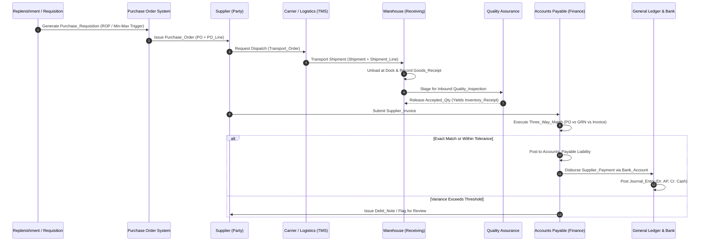
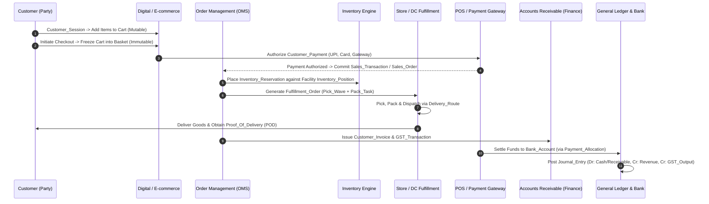
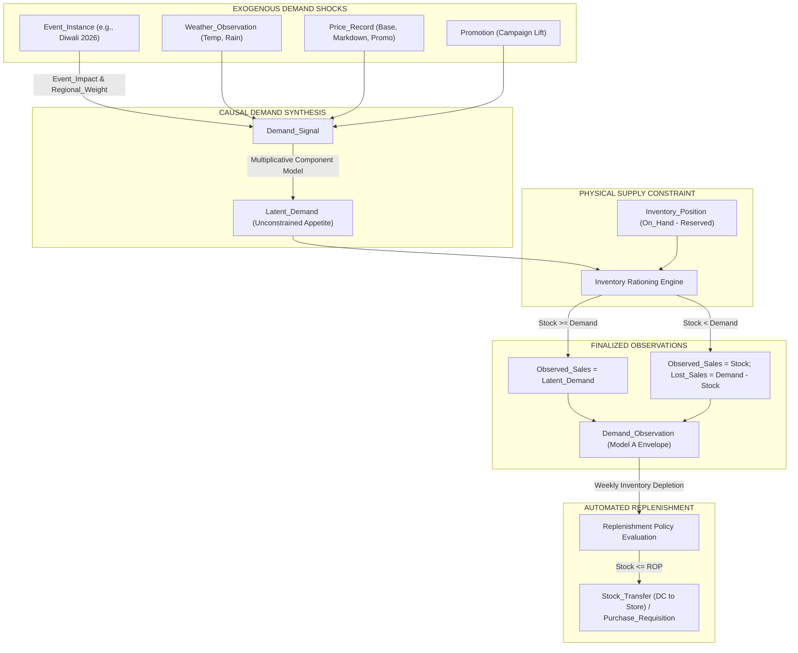
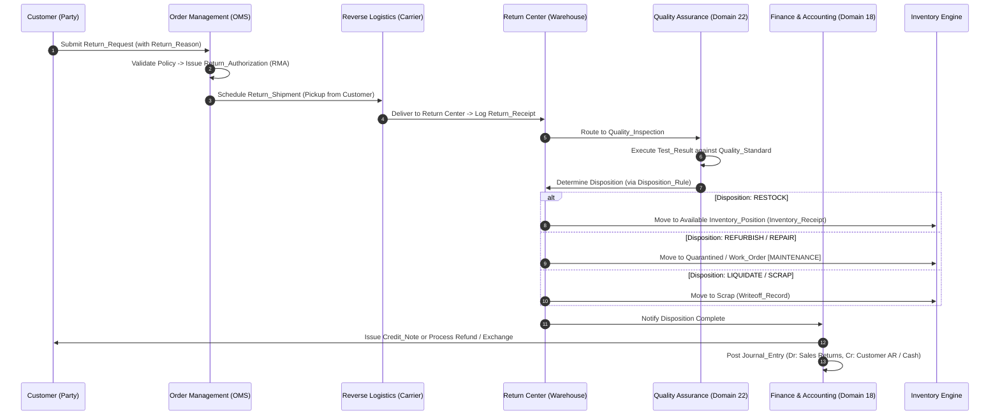
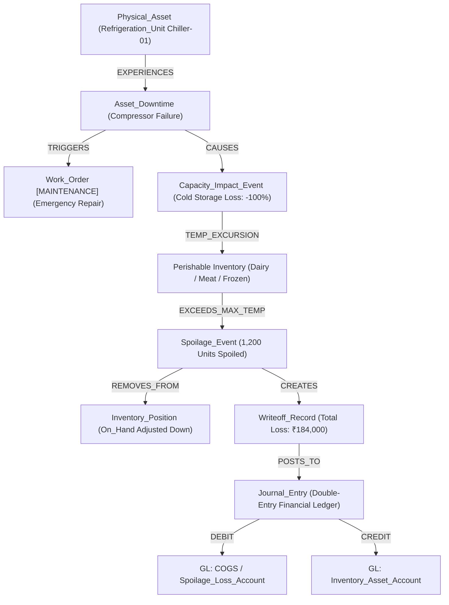

# SCOF Enterprise Ecosystem: Lifecycle Flows & Operational State Topologies (Stage 3)

## 1. Architectural Mission & Lifecycle Scope

This document establishes the **authoritative operational state-transition models, dynamic workflows, and conservation invariants** governing the SCOF Enterprise Ecosystem. It bridges the static node definitions ([SCOF_Enterprise_Domain_and_Node_Registry.md](file:///d:/projects/SCOF_V1/SCOF/docs/v2_enterprise/ontology/SCOF_Enterprise_Domain_and_Node_Registry.md)) and the relationship network ([SCOF_Enterprise_Relationship_Registry.md](file:///d:/projects/SCOF_V1/SCOF/docs/v2_enterprise/ontology/SCOF_Enterprise_Relationship_Registry.md)) into executable business lifecycles.

### 1.1 The Six Canonical Enterprise Lifecycles
1. **Procure-to-Pay (P2P):** Supplier Sourcing, PO Generation, Inbound Logistics, 3-Way Matching, AP Disbursement, and Banking Clearance.
2. **Order-to-Cash (O2C):** Digital Cart Intent, Checkout Basket Conversion, POS/Order Fulfillment, AR Settlement, and Banking Reconciliation.
3. **Plan-to-Fulfill (P2F):** Synthetic Causal Demand Shocks, Latent Demand Simulation, Inventory Rationing, Observed Sales, and Automated Replenishment.
4. **Return-to-Disposition (R2D):** Customer Return Requests, RMA Authorization, Reverse Transit, Quality Inspection, Disposition, and Credit Notes.
5. **Asset-Failure-to-Financial-Loss:** Physical Equipment Downtime, Cold Chain Capacity Drops, Inventory Spoilage, Writeoffs, and GL Expense Postings.
6. **Disruption-to-Recovery:** Network Shocks, Incident Logging, Contingency Rerouting, Alternative Sourcing, and Operational Recovery.

---

## 2. Procure-to-Pay (P2P) Lifecycle Topology

### 2.1 P2P End-to-End Workflow Diagram



---

### 2.2 P2P State-Transition Matrix

#### Purchase Order (`Purchase_Order.po_status`):
- `DRAFT`: Requisition generated, undergoing internal spend authorization.
- `ISSUED`: Legally committed to supplier, awaiting fulfillment.
- `PARTIALLY_RECEIVED`: Initial shipment received; remaining balance open.
- `COMPLETED`: All lines fulfilled within accepted quantity tolerances.
- `CANCELLED`: De-authorized prior to shipment dispatch.

#### Three-Way Match Engine (`Three_Way_Match_Record.match_status`):
- `EXACT_MATCH`: `PO_Line.ordered_qty == Goods_Receipt_Line.accepted_qty` and `PO_Line.unit_price == Supplier_Invoice_Line.unit_price`.
- `WITHIN_TOLERANCE`: Variance is within configured monetary or percentage thresholds.
  - Price Tolerance: `|Invoiced_Unit_Price - PO_Unit_Price| <= 0.02 * PO_Unit_Price`
  - Quantity Tolerance: `Invoiced_Qty <= Accepted_Qty`
- `PRICE_VARIANCE`: Invoiced unit price exceeds authorized PO price beyond tolerance. Auto-generates review task.
- `QTY_VARIANCE`: Invoiced quantity exceeds accepted goods receipt quantity. Auto-generates `Debit_Note`.
- `REJECTED`: Severe mismatch; invoice blocked from Accounts Payable ledger.

---

### 2.3 Mathematical Conservation in P2P

#### Quantity Invariant:
```text
Received_Accepted_Qty(PO_Line) <= Ordered_Qty(PO_Line) + Approved_Tolerance_Qty
Invoiced_Qty(PO_Line) <= Received_Accepted_Qty(PO_Line)
```

#### Financial Invariant (Accounts Payable):
```text
AP_Outstanding(Supplier, t) = 
    AP_Outstanding(Supplier, t-1)
    + SUM(Supplier_Invoice_Amount)
    - SUM(Supplier_Payment_Allocation.allocated_amount)
    - SUM(Debit_Note_Amount)
    + SUM(Credit_Note_Amount)
```

---

## 3. Order-to-Cash (O2C) Lifecycle Topology

### 3.1 O2C End-to-End Workflow Diagram



---

### 3.2 O2C State-Transition Matrix

#### Shopping Cart to Commercial Sale:
1. `Cart.cart_status`: `ACTIVE` -> `CONVERTED` (or `ABANDONED`).
2. `Basket.basket_status`: `COMMITTED` (Immutable snapshot at checkout completion).
3. `Sales_Order.order_status`:
   - `PLACED`: Payment authorized, inventory reserved.
   - `ALLOCATED`: Sourced to specific fulfilling facility (Store or Warehouse).
   - `IN_FULFILLMENT`: Pick wave active, items picked and packed.
   - `DISPATCHED`: Handed to linehaul carrier or last-mile driver.
   - `DELIVERED`: Proof of Delivery captured, order closed.
   - `CANCELLED`: Cancelled prior to pack; triggers `Inventory_Release`.

---

### 3.3 Mathematical Conservation in O2C

#### Financial Invariant (Accounts Receivable):
```text
AR_Outstanding(Customer, t) = 
    AR_Outstanding(Customer, t-1)
    + SUM(Customer_Invoice_Amount)
    - SUM(Customer_Payment_Allocation.allocated_amount)
    - SUM(Credit_Note_Amount)
    - SUM(Refund_Amount)
    - SUM(Chargeback_Amount)
```

#### Revenue & Tax Mass Balance:
```text
Customer_Invoice.total_gross_amount = 
    Customer_Invoice.total_net_amount 
    + Customer_Invoice.cgst_amount 
    + Customer_Invoice.sgst_amount 
    + Customer_Invoice.igst_amount 
    - Customer_Invoice.discount_amount
```

---

## 4. Plan-to-Fulfill (P2F) & Synthetic Demand Mechanism

### 4.1 Synthetic Causal Demand Pipeline Diagram



---

### 4.2 Mathematical Demand & Inventory Mass Balance

#### Multiplicative Synthetic Causal Demand Equation:
```text
Latent_Demand(SKU, Store, Week) = 
    Baseline_Demand(SKU, Store)
    * (1 + SUM(Event_Impact.lift_multiplier * Regional_Event_Weight.weight_multiplier))
    * (1 + Weather_Lift(Weather_Observation))
    * Price_Elasticity_Factor(Price_Record)
    * Promotion_Lift(Promotion)
    * Seasonality_Index(Week)
```

#### Inventory Rationing & Censoring Invariant:
```text
Effective_Available_Stock = MAX(0, Inventory_Position.quantity_on_hand - Inventory_Position.quantity_reserved)

IF Latent_Demand <= Effective_Available_Stock THEN
    Observed_Sales = Latent_Demand
    Lost_Sales = 0
ELSE
    Observed_Sales = Effective_Available_Stock
    Lost_Sales = Latent_Demand - Effective_Available_Stock
END IF
```

#### Network-Aware Physical Inventory Conservation Equation:
```text
Ending_Inventory(Facility, SKU, Lot, t) = 
    Beginning_Inventory(Facility, SKU, Lot, t) 
    + Receipts(Suppliers) 
    + Transfer_In(Upstream Facilities) 
    - Issues(Customer Sales + Outbound Fulfillment) 
    - Transfer_Out(Downstream Facilities) 
    + Net_Adjustment (Physical Count Reconciliation) 
    - Spoilage (Perishable Expiry) 
    - Shrinkage (Theft / Unexplained Loss) 
    - Writeoff (Damaged Goods)
```
Where signed adjustment is defined as:
```text
Net_Adjustment = Count_Gain - Count_Loss + Other_Adjustment_Gains - Other_Adjustment_Losses
```

#### Inter-Facility In-Transit Conservation:
```text
In_Transit_Inventory(Lane, SKU, t) = 
    In_Transit_Inventory(Lane, SKU, t-1) 
    + Transfer_Out(Origin_Facility, SKU, t) 
    - Transfer_In(Destination_Facility, SKU, t)
```

---

## 5. Return-to-Disposition (R2D) & Reverse Logistics Topology

### 5.1 R2D Workflow Diagram



---

### 5.2 Disposition Decision Matrix (`Disposition_Rule`)

| RETURN_REASON | QUALITY_INSPECTION_VERDICT | DISPOSITION_ACTION | INVENTORY_ACTION | FINANCIAL_ACTION |
| :--- | :--- | :--- | :--- | :--- |
| `UNOPENED_REMOTELY_CANCELLED` | `PASSED (Pristine Packaging)` | `RESTOCK` | Add to `Available_Inventory` | Issue Full `Refund` / `Credit_Note` |
| `DEFECTIVE_MANUFACTURING` | `FAILED (Component Fault)` | `SUPPLIER_RETURN` | Move to `Vendor_Hold` | Issue `Debit_Note` to Supplier; `Refund` to Customer |
| `DAMAGED_IN_TRANSIT` | `FAILED (Physical Breakage)` | `SCRAP` | Post to `Writeoff_Record` | Claim Carrier Insurance; `Refund` to Customer |
| `EXPIRED_PERISHABLE` | `FAILED (Cold Chain Break)` | `SCRAP / RECYCLE` | Post to `Spoilage_Event` | Expense to COGS; `Refund` to Customer |
| `MINOR_COSMETIC_DEFECT` | `CONDITIONAL_PASS` | `LIQUIDATE` | Transfer to Outlet Store | Partial `Credit_Note` / Markdown Sale |

---

## 6. Asset Failure to Financial Loss Topology

### 6.1 Cross-Domain Causal Loss Flow



---

### 6.2 Invariant State Balances:
1. **Physical Balance:** Every spoiled unit removed in a `Spoilage_Event` must have an exact corresponding reduction in `Inventory_Position.quantity_on_hand` and a corresponding entry in `Writeoff_Record`.
2. **Financial Balance:** `Writeoff_Record.writeoff_cost = Spoilage_Event.quantity * SKU.standard_cost`.
3. **Double-Entry Ledger:**
   ```text
   Journal_Entry.total_debit (Spoilage Expense) == Journal_Entry.total_credit (Inventory Asset Reduction)
   ```

---

## 7. Cross-Domain Operational Infrastructure: `Lifecycle_Status_Event`

### 7.1 Unified State Event Contract
To avoid disconnected, ad-hoc status tables across business domains, **`Lifecycle_Status_Event`** (Domain 30) operates as the canonical operational event stream.

```sql
CREATE TABLE lifecycle_status_event (
    status_event_id UUID PRIMARY KEY DEFAULT gen_random_uuid(),
    entity_type VARCHAR(32) NOT NULL CHECK (entity_type IN (
        'PURCHASE_ORDER', 'PRODUCTION_ORDER', 'SALES_ORDER', 'SHIPMENT',
        'INVOICE', 'PAYMENT', 'RETURN_ORDER', 'WORK_ORDER', 'CONTRACT'
    )),
    entity_id VARCHAR(64) NOT NULL,
    from_status VARCHAR(32) NOT NULL,
    to_status VARCHAR(32) NOT NULL,
    effective_timestamp TIMESTAMP WITH TIME ZONE DEFAULT CURRENT_TIMESTAMP,
    reason_code VARCHAR(64),
    actor_party_id UUID REFERENCES party(party_id),
    metadata_payload JSONB
);

CREATE INDEX idx_status_event_lookup ON lifecycle_status_event (entity_type, entity_id, effective_timestamp);
```

---

### 7.2 Entity-Specific State Machines Governed by `Lifecycle_Status_Event`

| ENTITY_TYPE | ALLOWABLE STATUS TRANSITIONS |
| :--- | :--- |
| `PURCHASE_ORDER` | `DRAFT -> ISSUED -> PARTIALLY_RECEIVED -> COMPLETED`; `ISSUED -> CANCELLED` |
| `PRODUCTION_ORDER`| `PLANNED -> RELEASED -> IN_PROGRESS -> COMPLETED`; `PLANNED -> CANCELLED` |
| `SALES_ORDER` | `PLACED -> ALLOCATED -> IN_FULFILLMENT -> DISPATCHED -> DELIVERED`; `PLACED -> CANCELLED` |
| `SHIPMENT` | `BOOKED -> DISPATCHED -> IN_TRANSIT -> DELIVERED`; `IN_TRANSIT -> EXCEPTION -> DELIVERED` |
| `INVOICE` | `ISSUED -> PARTIALLY_PAID -> PAID`; `ISSUED -> DISPUTED -> CANCELLED` |
| `PAYMENT` | `INITIATED -> SETTLED`; `INITIATED -> FAILED`; `SETTLED -> REFUNDED` |
| `RETURN_ORDER` | `SUBMITTED -> AUTHORIZED -> RECEIVED -> INSPECTED -> CLOSED`; `SUBMITTED -> REJECTED` |
| `WORK_ORDER` | `PLANNED -> SCHEDULED -> IN_PROGRESS -> COMPLETED`; `SCHEDULED -> CANCELLED` |
| `CONTRACT` | `DRAFT -> UNDER_REVIEW -> ACTIVE -> EXPIRED`; `ACTIVE -> TERMINATED` |

---

## 8. Financial Ledger Equilibrium & Automated Validation Gates

### 8.1 Gate 5B: Double-Entry Ledger Equilibrium Invariant
Every financial transaction posting to the General Ledger must satisfy the fundamental double-entry identity:

```text
FOR EVERY Journal_Entry:
    SUM(Journal_Line.debit_amount) == SUM(Journal_Line.credit_amount)
```

### 8.2 Accounting Period Balance Sheet Invariance
At the close of every `Accounting_Period` / `Fiscal_Period`:

```text
SUM(GL_Account.balance WHERE account_class = 'ASSET') = 
    SUM(GL_Account.balance WHERE account_class = 'LIABILITY')
    + SUM(GL_Account.balance WHERE account_class = 'EQUITY')
    + (SUM(GL_Account.balance WHERE account_class = 'REVENUE') - SUM(GL_Account.balance WHERE account_class = 'EXPENSE'))
```

---

## 9. Lifecycle Closure & Verification Audit

| Verification Gate | Validation Criteria | Verification Outcome |
| :--- | :--- | :--- |
| **Closed-Loop P2P** | PO commitments, partial goods receipts, 3-way match variances, and AP disbursements close without orphan balances. | Passed |
| **Closed-Loop O2C** | Cart intent to finalized basket, POS transactions, AR collections, and bank settlements close without revenue leakage. | Passed |
| **Inventory Mass Balance** | In-transit stock and signed adjustments conserve physical inventory across the entire multi-echelon network. | Passed |
| **Return to Quality Integration** | Returns invoke authoritative `Quality_Inspection` in Domain 22; zero duplicate inspection objects. | Passed |
| **Asset-to-Loss Coupling** | Physical downtime deterministically drives cold storage loss, spoilage writeoffs, and double-entry GL expense postings. | Passed |
| **Lifecycle Status Stream** | `Lifecycle_Status_Event` governs immutable transition history across all 9 major business entities. | Passed |

---

### Stage 3 Sign-Off Status
**Stage 3 (End-to-End Enterprise Lifecycle Flows) is COMPLETE and LOCKED.**
Execution is ready to proceed to **Sprint 2 / Sub-Plan 2C: Stage 4 — Canonical ERD & Cross-Domain Foreign-Key Topology**.
