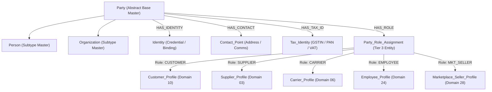
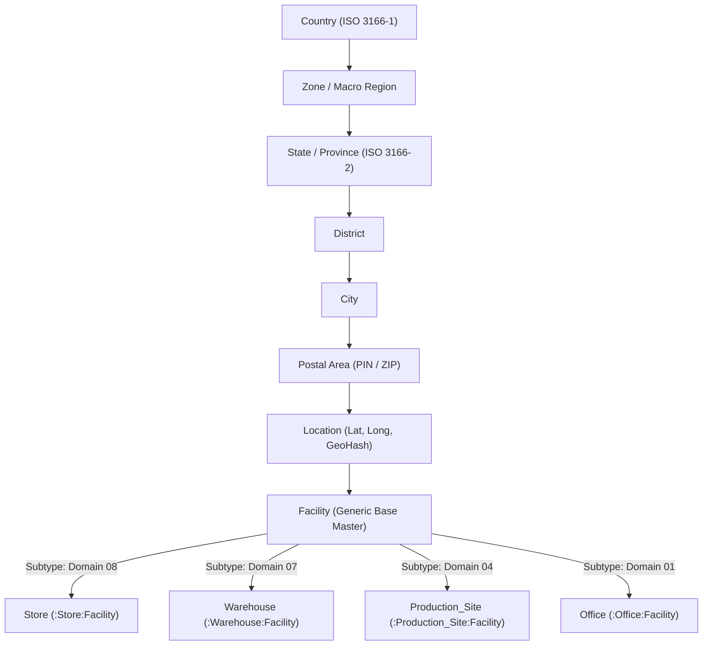
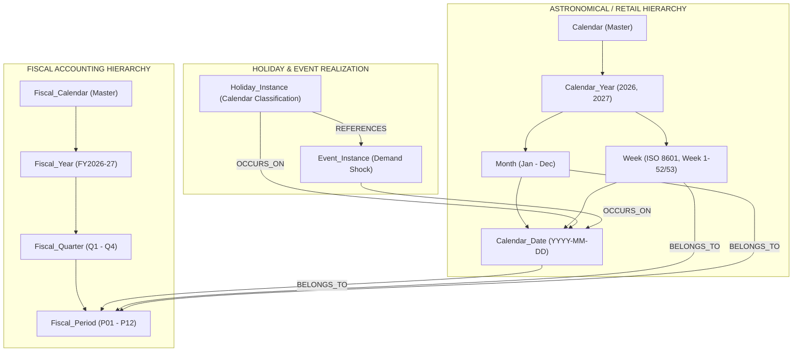
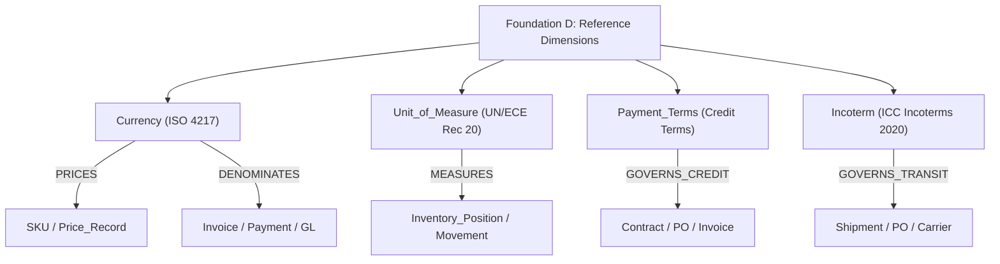

# SCOF Enterprise Ecosystem: Foundational Ontology Specification (Stage 0A)

## 1. Architectural Mission & Foundation Boundaries

The Foundational Ontology establishes the shared, cross-cutting platform infrastructure for the SCOF Enterprise Ecosystem. It decouples core business logic (merchandise, sales, procurement, inventory, finance, and demand intelligence) from the fundamental primitives of:
1. **Who acts:** Legal persons, organizations, identities, and their operational roles (**Foundation A: Party & Identity**).
2. **Where actions occur:** Spatial coordinates, administrative jurisdictions, and physical facilities (**Foundation B: Geography & Location**).
3. **When actions occur:** Astronomical/retail time, dual fiscal accounting periods, and holiday classifications (**Foundation C: Time & Dual Calendar**).
4. **How attributes are standardized:** Currencies, units of measure, credit terms, and trade terms (**Foundation D: Reference Dimensions & Standards**).

Every foundational entity is formally classified according to the six architectural archetypes, documented under the authoritative **26-field metadata specification**, and assigned exact relational and graph mapping rules.

---

## 2. Foundation A: Party & Identity Specification

### 2.1 The Party Model & Role Realization Pattern
To eliminate actor duplication across suppliers, customers, carriers, employees, and marketplace sellers, all legal actors inherit from the abstract base master `Party`.



#### Canonical Role Taxonomy (`ROLE_TYPE` Enum):
- `CUSTOMER`: Retail consumer, B2B buyer, institutional client.
- `SUPPLIER`: Raw material vendor, finished goods supplier, primary contractor.
- `MANUFACTURER`: Industrial production entity, toll manufacturer, contract packager.
- `PRODUCER`: Agricultural farm, dairy cooperative, plantation, primary extractor.
- `AGGREGATOR`: Produce aggregator, agricultural cooperative, mandi intermediary.
- `WHOLESALER`: Bulk merchant, regional cash-and-carry distributor.
- `DISTRIBUTOR`: Authorized regional stockist, channel distributor, importer/exporter.
- `IMPORTER`: Cross-border importing legal entity.
- `EXPORTER`: Cross-border exporting legal entity.
- `CARRIER`: Freight transport operator, linehaul fleet company, parcel delivery carrier.
- `3PL_PROVIDER`: Third-party logistics operator managing warehousing or multi-modal transit.
- `EMPLOYEE`: Internal enterprise worker, corporate staff, field personnel.
- `DRIVER`: Vehicle operator, delivery associate, long-haul driver.
- `MARKETPLACE_SELLER`: Third-party merchant selling via enterprise digital storefront.

---

### 2.2 Foundation A Node Inventory & Metadata (26 Fields)

#### 1. `Party`
- `NODE_ID`: `NOD_FND_PARTY_001`
- `NODE_NAME`: `Party`
- `DOMAIN`: `Foundation A: Party & Identity`
- `DESCRIPTION`: Abstract legal entity capable of entering contracts, holding assets, issuing payments, or receiving goods. Generalization parent of Person and Organization.
- `ENTITY_TYPE`: `Conceptual / Legal Base`
- `CLASS`: `Master Node (Archetype 1)`
- `PRIMARY_KEY`: `party_id` (UUID)
- `IDENTIFIER_TYPE`: `UUID`
- `BUSINESS_KEY`: `party_code` (e.g., `PTY-100294`)
- `NATURAL_KEY`: `None (Abstract Supertype)`
- `PARENT_NODE`: `None`
- `OWNERSHIP`: `Enterprise Architecture / Master Data Management`
- `DATA_OWNER`: `Enterprise Core Platform Team`
- `LIFECYCLE`: `Versioned (SCD Type 2)`
- `TEMPORAL_GRAIN`: `Static / Date-Effective`
- `TEMPORAL_STATIC`: `True`
- `VERSIONING_STRATEGY`: `SCD Type 2 (effective_start, effective_end, is_current)`
- `SOFT_DELETE_RULE`: `Soft Delete (status = 'INACTIVE')`
- `SENSITIVITY_CLASS`: `Confidential`
- `PII_FLAG`: `False (Abstract)`
- `FINANCIAL_FLAG`: `True (Legal Counterparty)`
- `GEOGRAPHIC_SCOPE`: `Global`
- `SOURCE_SYSTEM`: `MDM / ERP`
- `CORE_ATTRIBUTES`: `party_id (UUID)`, `party_code (VARCHAR(32))`, `party_type (ENUM: PERSON, ORGANIZATION)`, `legal_name (VARCHAR(255))`, `trade_name (VARCHAR(255))`, `status (ENUM: ACTIVE, INACTIVE, SUSPENDED)`, `created_at (TIMESTAMP)`, `updated_at (TIMESTAMP)`
- `REFERENCE_DATA_DEPENDENCIES`: `Country`, `Currency`
- `CRITICAL_RELATIONSHIPS`: `HAS_ROLE -> Party_Role_Assignment`, `HAS_IDENTITY -> Identity`, `HAS_CONTACT -> Contact_Point`, `HAS_TAX_ID -> Tax_Identity`, `HOLDS_ACCOUNT -> Bank_Account`

#### 2. `Person`
- `NODE_ID`: `NOD_FND_PARTY_002`
- `NODE_NAME`: `Person`
- `DOMAIN`: `Foundation A: Party & Identity`
- `DESCRIPTION`: Concrete individual human being acting within the enterprise ecosystem (Customer, Employee, Driver).
- `ENTITY_TYPE`: `Physical / Legal Subtype`
- `CLASS`: `Master Node (Archetype 1)`
- `PRIMARY_KEY`: `party_id` (UUID, FK to Party)
- `IDENTIFIER_TYPE`: `UUID`
- `BUSINESS_KEY`: `person_code` (e.g., `PER-004918`)
- `NATURAL_KEY`: `national_id_hash (SHA-256)`
- `PARENT_NODE`: `Party`
- `OWNERSHIP`: `HR / Customer Operations`
- `DATA_OWNER`: `Identity Platform Team`
- `LIFECYCLE`: `Versioned (SCD Type 2)`
- `TEMPORAL_GRAIN`: `Static`
- `TEMPORAL_STATIC`: `True`
- `VERSIONING_STRATEGY`: `SCD Type 2`
- `SOFT_DELETE_RULE`: `Soft Delete`
- `SENSITIVITY_CLASS`: `Restricted`
- `PII_FLAG`: `True`
- `FINANCIAL_FLAG`: `False`
- `GEOGRAPHIC_SCOPE`: `Country / Regional`
- `SOURCE_SYSTEM`: `CRM / HRIS / POS`
- `CORE_ATTRIBUTES`: `party_id (UUID)`, `first_name (VARCHAR(100))`, `middle_name (VARCHAR(100))`, `last_name (VARCHAR(100))`, `date_of_birth (DATE)`, `gender (ENUM: MALE, FEMALE, NON_BINARY, UNDISCLOSED)`, `nationality (VARCHAR(3))`
- `REFERENCE_DATA_DEPENDENCIES`: `Country`
- `CRITICAL_RELATIONSHIPS`: `INHERITS -> Party`

#### 3. `Organization`
- `NODE_ID`: `NOD_FND_PARTY_003`
- `NODE_NAME`: `Organization`
- `DOMAIN`: `Foundation A: Party & Identity`
- `DESCRIPTION`: Concrete legal, corporate, or governmental entity (Enterprise legal entities, suppliers, carriers, distributors, aggregators).
- `ENTITY_TYPE`: `Legal Subtype`
- `CLASS`: `Master Node (Archetype 1)`
- `PRIMARY_KEY`: `party_id` (UUID, FK to Party)
- `IDENTIFIER_TYPE`: `UUID`
- `BUSINESS_KEY`: `org_code` (e.g., `ORG-000812`)
- `NATURAL_KEY`: `incorporation_number (e.g., CIN, EIN)`
- `PARENT_NODE`: `Party`
- `OWNERSHIP`: `Corporate Governance / Procurement`
- `DATA_OWNER`: `Enterprise Core Platform Team`
- `LIFECYCLE`: `Versioned (SCD Type 2)`
- `TEMPORAL_GRAIN`: `Static`
- `TEMPORAL_STATIC`: `True`
- `VERSIONING_STRATEGY`: `SCD Type 2`
- `SOFT_DELETE_RULE`: `Soft Delete`
- `SENSITIVITY_CLASS`: `Internal`
- `PII_FLAG`: `False`
- `FINANCIAL_FLAG`: `True`
- `GEOGRAPHIC_SCOPE`: `Global / Country`
- `SOURCE_SYSTEM`: `ERP / Procurement Portal`
- `CORE_ATTRIBUTES`: `party_id (UUID)`, `registered_name (VARCHAR(255))`, `organization_type (ENUM: CORPORATE, LLC, PARTNERSHIP, SOLE_PROPRIETORSHIP, COOPERATIVE, GOVERNMENT)`, `incorporation_date (DATE)`, `incorporation_country_id (FK)`, `website_url (VARCHAR(255))`
- `REFERENCE_DATA_DEPENDENCIES`: `Country`, `Currency`
- `CRITICAL_RELATIONSHIPS`: `INHERITS -> Party`, `SUBSIDIARY_OF -> Organization`

#### 4. `Identity`
- `NODE_ID`: `NOD_FND_PARTY_004`
- `NODE_NAME`: `Identity`
- `DOMAIN`: `Foundation A: Party & Identity`
- `DESCRIPTION`: Digital or operational authentication and identity credentials bound to a party across customer accounts, employee logins, and partner API credentials.
- `ENTITY_TYPE`: `Security / Credential Master`
- `CLASS`: `Master Node (Archetype 1)`
- `PRIMARY_KEY`: `identity_id` (UUID)
- `IDENTIFIER_TYPE`: `UUID`
- `BUSINESS_KEY`: `username / account_number`
- `NATURAL_KEY`: `email_address / phone_number / sso_subject_id`
- `PARENT_NODE`: `Party`
- `OWNERSHIP`: `Security & Identity Engineering`
- `DATA_OWNER`: `IAM Team`
- `LIFECYCLE`: `State-Machine (ACTIVE, LOCKED, REVOKED, EXPIRED)`
- `TEMPORAL_GRAIN`: `Timestamp`
- `TEMPORAL_STATIC`: `False`
- `VERSIONING_STRATEGY`: `SCD Type 1 with Audit Log`
- `SOFT_DELETE_RULE`: `Soft Delete (status = 'REVOKED')`
- `SENSITIVITY_CLASS`: `Restricted`
- `PII_FLAG`: `True`
- `FINANCIAL_FLAG`: `False`
- `GEOGRAPHIC_SCOPE`: `Global`
- `SOURCE_SYSTEM`: `IdP (Okta / Keycloak / Cognito) / CRM`
- `CORE_ATTRIBUTES`: `identity_id (UUID)`, `party_id (UUID, FK)`, `identity_type (ENUM: CUSTOMER_ACCOUNT, EMPLOYEE_LOGIN, PARTNER_API_KEY, SYSTEM_SERVICE)`, `credential_identifier (VARCHAR(255))`, `auth_provider (VARCHAR(64))`, `status (ENUM: ACTIVE, LOCKED, REVOKED, EXPIRED)`, `last_login_at (TIMESTAMP)`
- `REFERENCE_DATA_DEPENDENCIES`: `None`
- `CRITICAL_RELATIONSHIPS`: `BOUND_TO -> Party`, `AUTHENTICATES -> Customer_Session`

#### 5. `Contact_Point`
- `NODE_ID`: `NOD_FND_PARTY_005`
- `NODE_NAME`: `Contact_Point`
- `DOMAIN`: `Foundation A: Party & Identity`
- `DESCRIPTION`: Physical address, email, telephone, or digital communication endpoint belonging to a party or facility.
- `ENTITY_TYPE`: `Operational Master`
- `CLASS`: `Master Node (Archetype 1)`
- `PRIMARY_KEY`: `contact_point_id` (UUID)
- `IDENTIFIER_TYPE`: `UUID`
- `BUSINESS_KEY`: `contact_code`
- `NATURAL_KEY`: `normalized_contact_value`
- `PARENT_NODE`: `Party / Facility`
- `OWNERSHIP`: `Customer Operations / Procurement`
- `DATA_OWNER`: `Enterprise MDM Team`
- `LIFECYCLE`: `Versioned (SCD Type 2)`
- `TEMPORAL_GRAIN`: `Static`
- `TEMPORAL_STATIC`: `True`
- `VERSIONING_STRATEGY`: `SCD Type 2`
- `SOFT_DELETE_RULE`: `Soft Delete`
- `SENSITIVITY_CLASS`: `Restricted`
- `PII_FLAG`: `True`
- `FINANCIAL_FLAG`: `False`
- `GEOGRAPHIC_SCOPE`: `Postal Area / City`
- `SOURCE_SYSTEM`: `CRM / ERP / POS`
- `CORE_ATTRIBUTES`: `contact_point_id (UUID)`, `party_id (UUID, FK)`, `contact_type (ENUM: PHYSICAL_ADDRESS, EMAIL, PHONE, WEBHOOK)`, `purpose (ENUM: BILLING, SHIPPING, LEGAL, OPERATIONS, PERSONAL)`, `address_line_1 (VARCHAR(255))`, `address_line_2 (VARCHAR(255))`, `postal_area_id (FK)`, `city_id (FK)`, `phone_number (VARCHAR(32))`, `email_address (VARCHAR(255))`, `is_primary (BOOLEAN)`
- `REFERENCE_DATA_DEPENDENCIES`: `Postal_Area`, `City`, `Country`
- `CRITICAL_RELATIONSHIPS`: `BELONGS_TO -> Party`, `LOCATED_IN -> Postal_Area`

#### 6. `Tax_Identity`
- `NODE_ID`: `NOD_FND_PARTY_006`
- `NODE_NAME`: `Tax_Identity`
- `DOMAIN`: `Foundation A: Party & Identity`
- `DESCRIPTION`: Official statutory tax registration identifier for an organization or person within a legal tax jurisdiction.
- `ENTITY_TYPE`: `Compliance / Legal Master`
- `CLASS`: `Master Node (Archetype 1)`
- `PRIMARY_KEY`: `tax_identity_id` (UUID)
- `IDENTIFIER_TYPE`: `UUID`
- `BUSINESS_KEY`: `tax_registration_number` (e.g., GSTIN `33AAAAA0000A1Z5`, PAN, VAT)
- `NATURAL_KEY`: `tax_registration_number`
- `PARENT_NODE`: `Party`
- `OWNERSHIP`: `Corporate Tax & Legal`
- `DATA_OWNER`: `Finance & Tax Platform Team`
- `LIFECYCLE`: `Versioned (SCD Type 2)`
- `TEMPORAL_GRAIN`: `Date`
- `TEMPORAL_STATIC`: `True`
- `VERSIONING_STRATEGY`: `SCD Type 2`
- `SOFT_DELETE_RULE`: `Soft Delete (status = 'CANCELLED')`
- `SENSITIVITY_CLASS`: `Confidential`
- `PII_FLAG`: `False`
- `FINANCIAL_FLAG`: `True`
- `GEOGRAPHIC_SCOPE`: `Country / State`
- `SOURCE_SYSTEM`: `ERP / Tax Compliance Portal`
- `CORE_ATTRIBUTES`: `tax_identity_id (UUID)`, `party_id (UUID, FK)`, `tax_jurisdiction_id (FK)`, `tax_type (ENUM: GSTIN, PAN, VAT, TIN, EIN)`, `registration_number (VARCHAR(64))`, `legal_business_name (VARCHAR(255))`, `registration_date (DATE)`, `status (ENUM: ACTIVE, CANCELLED, SUSPENDED)`
- `REFERENCE_DATA_DEPENDENCIES`: `Tax_Jurisdiction`, `Country`
- `CRITICAL_RELATIONSHIPS`: `ISSUED_TO -> Party`, `GOVERNED_BY -> Tax_Jurisdiction`

---

## 3. Foundation B: Geography & Location Specification

### 3.1 Strict Spatial Hierarchy & Facility Specialization
Geography establishes an unambiguous administrative and geospatial hierarchy. Physical facilities (Stores, Warehouses, Distribution Centers, Production Sites, Offices) inherit from the generic base master `Facility` under `Location`.



---

### 3.2 Foundation B Node Inventory & Metadata (26 Fields)

#### 1. `Country`
- `NODE_ID`: `NOD_FND_GEO_001`
- `NODE_NAME`: `Country`
- `DOMAIN`: `Foundation B: Geography & Location`
- `DESCRIPTION`: Sovereign geopolitical nation-state recognized internationally. Root of the spatial hierarchy.
- `ENTITY_TYPE`: `Spatial Master`
- `CLASS`: `Master Node (Archetype 1)`
- `PRIMARY_KEY`: `country_id` (CHAR(3) ISO Alpha-3, e.g., `IND`, `USA`, `GBR`)
- `IDENTIFIER_TYPE`: `Natural ISO Code`
- `BUSINESS_KEY`: `country_iso_code`
- `NATURAL_KEY`: `country_iso_numeric` (e.g., `356`)
- `PARENT_NODE`: `None`
- `OWNERSHIP`: `Enterprise Architecture`
- `DATA_OWNER`: `Enterprise MDM Team`
- `LIFECYCLE`: `Immutable`
- `TEMPORAL_GRAIN`: `Static`
- `TEMPORAL_STATIC`: `True`
- `VERSIONING_STRATEGY`: `SCD Type 0`
- `SOFT_DELETE_RULE`: `None`
- `SENSITIVITY_CLASS`: `Public`
- `PII_FLAG`: `False`
- `FINANCIAL_FLAG`: `False`
- `GEOGRAPHIC_SCOPE`: `Global`
- `SOURCE_SYSTEM`: `ISO 3166-1 Standard`
- `CORE_ATTRIBUTES`: `country_id (CHAR(3))`, `country_name (VARCHAR(100))`, `iso_2_code (CHAR(2))`, `currency_id (CHAR(3), FK)`, `phone_country_code (VARCHAR(8))`
- `REFERENCE_DATA_DEPENDENCIES`: `Currency`
- `CRITICAL_RELATIONSHIPS`: `CONTAINS -> Zone_Macro_Region`, `CONTAINS -> State_Province`

#### 2. `Zone_Macro_Region`
- `NODE_ID`: `NOD_FND_GEO_002`
- `NODE_NAME`: `Zone_Macro_Region`
- `DOMAIN`: `Foundation B: Geography & Location`
- `DESCRIPTION`: Broad geographic macro-region within a country (e.g., South, North, West, East) used for regional event weighting, climate analysis, and supply network zoning.
- `ENTITY_TYPE`: `Spatial Master`
- `CLASS`: `Master Node (Archetype 1)`
- `PRIMARY_KEY`: `zone_id` (VARCHAR(32), e.g., `ZONE_SOUTH`, `ZONE_NORTH`)
- `IDENTIFIER_TYPE`: `Natural Key`
- `BUSINESS_KEY`: `zone_code`
- `NATURAL_KEY`: `zone_code`
- `PARENT_NODE`: `Country`
- `OWNERSHIP`: `Supply Chain Strategy / Merchandise Planning`
- `DATA_OWNER`: `Demand Intelligence Team`
- `LIFECYCLE`: `Versioned (SCD Type 1)`
- `TEMPORAL_GRAIN`: `Static`
- `TEMPORAL_STATIC`: `True`
- `VERSIONING_STRATEGY`: `SCD Type 1`
- `SOFT_DELETE_RULE`: `Soft Delete`
- `SENSITIVITY_CLASS`: `Internal`
- `PII_FLAG`: `False`
- `FINANCIAL_FLAG`: `False`
- `GEOGRAPHIC_SCOPE`: `National`
- `SOURCE_SYSTEM`: `Enterprise Network Configuration`
- `CORE_ATTRIBUTES`: `zone_id (VARCHAR(32))`, `country_id (CHAR(3), FK)`, `zone_name (VARCHAR(100))`, `climate_zone (ENUM: TROPICAL_MONSOON, HUMID_SUBTROPICAL, ARID, TEMPERATE)`
- `REFERENCE_DATA_DEPENDENCIES`: `Country`
- `CRITICAL_RELATIONSHIPS`: `WITHIN_COUNTRY -> Country`, `TARGETED_BY -> Regional_Event_Weight`, `OBSERVED_BY -> Weather_Observation`

#### 3. `State_Province`
- `NODE_ID`: `NOD_FND_GEO_003`
- `NODE_NAME`: `State_Province`
- `DOMAIN`: `Foundation B: Geography & Location`
- `DESCRIPTION`: Primary sub-national political administrative subdivision (e.g., Tamil Nadu, Karnataka, Maharashtra) establishing tax jurisdiction boundaries.
- `ENTITY_TYPE`: `Spatial Master`
- `CLASS`: `Master Node (Archetype 1)`
- `PRIMARY_KEY`: `state_id` (VARCHAR(16), ISO 3166-2, e.g., `IN-TN`, `IN-KA`, `IN-MH`)
- `IDENTIFIER_TYPE`: `Natural ISO Code`
- `BUSINESS_KEY`: `state_code`
- `NATURAL_KEY`: `state_code`
- `PARENT_NODE`: `Zone_Macro_Region / Country`
- `OWNERSHIP`: `Tax & Legal / Store Operations`
- `DATA_OWNER`: `Enterprise MDM Team`
- `LIFECYCLE`: `Immutable`
- `TEMPORAL_GRAIN`: `Static`
- `TEMPORAL_STATIC`: `True`
- `VERSIONING_STRATEGY`: `SCD Type 0`
- `SOFT_DELETE_RULE`: `None`
- `SENSITIVITY_CLASS`: `Public`
- `PII_FLAG`: `False`
- `FINANCIAL_FLAG`: `True (Tax Jurisdiction Parent)`
- `GEOGRAPHIC_SCOPE`: `State`
- `SOURCE_SYSTEM`: `ISO 3166-2 Standard`
- `CORE_ATTRIBUTES`: `state_id (VARCHAR(16))`, `country_id (CHAR(3), FK)`, `zone_id (VARCHAR(32), FK)`, `state_name (VARCHAR(100))`, `gst_state_code (CHAR(2))`
- `REFERENCE_DATA_DEPENDENCIES`: `Country`, `Zone_Macro_Region`
- `CRITICAL_RELATIONSHIPS`: `CONTAINS -> District`, `GOVERNS -> Tax_Jurisdiction`

#### 4. `District`
- `NODE_ID`: `NOD_FND_GEO_004`
- `NODE_NAME`: `District`
- `DOMAIN`: `Foundation B: Geography & Location`
- `DESCRIPTION`: Secondary administrative division within a state (e.g., Chennai District, Bengaluru Urban) used for localized governance and logistics zoning.
- `ENTITY_TYPE`: `Spatial Master`
- `CLASS`: `Master Node (Archetype 1)`
- `PRIMARY_KEY`: `district_id` (VARCHAR(32))
- `IDENTIFIER_TYPE`: `Sequential / Natural Key`
- `BUSINESS_KEY`: `district_code`
- `NATURAL_KEY`: `census_district_code`
- `PARENT_NODE`: `State_Province`
- `OWNERSHIP`: `Logistics & Network Operations`
- `DATA_OWNER`: `Enterprise MDM Team`
- `LIFECYCLE`: `Immutable`
- `TEMPORAL_GRAIN`: `Static`
- `TEMPORAL_STATIC`: `True`
- `VERSIONING_STRATEGY`: `SCD Type 0`
- `SOFT_DELETE_RULE`: `None`
- `SENSITIVITY_CLASS`: `Public`
- `PII_FLAG`: `False`
- `FINANCIAL_FLAG`: `False`
- `GEOGRAPHIC_SCOPE`: `District`
- `SOURCE_SYSTEM`: `National Census / Administrative Registry`
- `CORE_ATTRIBUTES`: `district_id (VARCHAR(32))`, `state_id (VARCHAR(16), FK)`, `district_name (VARCHAR(100))`
- `REFERENCE_DATA_DEPENDENCIES`: `State_Province`
- `CRITICAL_RELATIONSHIPS`: `WITHIN_STATE -> State_Province`, `CONTAINS -> City`

#### 5. `City`
- `NODE_ID`: `NOD_FND_GEO_005`
- `NODE_NAME`: `City`
- `DOMAIN`: `Foundation B: Geography & Location`
- `DESCRIPTION`: Urban or municipal settlement center (e.g., Chennai, Bengaluru, Coimbatore, Madurai) anchoring retail store clusters and local delivery hubs.
- `ENTITY_TYPE`: `Spatial Master`
- `CLASS`: `Master Node (Archetype 1)`
- `PRIMARY_KEY`: `city_id` (VARCHAR(32), e.g., `CTY_CHENNAI`, `CTY_BLR`)
- `IDENTIFIER_TYPE`: `Natural / Sequential Key`
- `BUSINESS_KEY`: `city_code`
- `NATURAL_KEY`: `city_name + state_code`
- `PARENT_NODE`: `District`
- `OWNERSHIP`: `Retail Real Estate / Logistics`
- `DATA_OWNER`: `Enterprise MDM Team`
- `LIFECYCLE`: `Versioned (SCD Type 1)`
- `TEMPORAL_GRAIN`: `Static`
- `TEMPORAL_STATIC`: `True`
- `VERSIONING_STRATEGY`: `SCD Type 1`
- `SOFT_DELETE_RULE`: `Soft Delete`
- `SENSITIVITY_CLASS`: `Public`
- `PII_FLAG`: `False`
- `FINANCIAL_FLAG`: `False`
- `GEOGRAPHIC_SCOPE`: `Municipal`
- `SOURCE_SYSTEM`: `Municipal Registry / GIS`
- `CORE_ATTRIBUTES`: `city_id (VARCHAR(32))`, `district_id (VARCHAR(32), FK)`, `city_name (VARCHAR(100))`, `tier (ENUM: TIER_1, TIER_2, TIER_3)`, `population (INTEGER)`
- `REFERENCE_DATA_DEPENDENCIES`: `District`, `State_Province`
- `CRITICAL_RELATIONSHIPS`: `WITHIN_DISTRICT -> District`, `CONTAINS -> Postal_Area`, `CONTAINS -> Facility`

#### 6. `Postal_Area`
- `NODE_ID`: `NOD_FND_GEO_006`
- `NODE_NAME`: `Postal_Area`
- `DOMAIN`: `Foundation B: Geography & Location`
- `DESCRIPTION`: Postal or ZIP code delivery zone (e.g., `600001`, `560001`) defining fulfillment catchments and last-mile routing boundaries.
- `ENTITY_TYPE`: `Spatial Master`
- `CLASS`: `Master Node (Archetype 1)`
- `PRIMARY_KEY`: `postal_area_id` (VARCHAR(16), e.g., `PIN_600001`)
- `IDENTIFIER_TYPE`: `Postal Code`
- `BUSINESS_KEY`: `postal_code`
- `NATURAL_KEY`: `postal_code`
- `PARENT_NODE`: `City`
- `OWNERSHIP`: `Fulfillment & Last Mile Logistics`
- `DATA_OWNER`: `Logistics Engineering Team`
- `LIFECYCLE`: `Immutable`
- `TEMPORAL_GRAIN`: `Static`
- `TEMPORAL_STATIC`: `True`
- `VERSIONING_STRATEGY`: `SCD Type 0`
- `SOFT_DELETE_RULE`: `None`
- `SENSITIVITY_CLASS`: `Public`
- `PII_FLAG`: `False`
- `FINANCIAL_FLAG`: `False`
- `GEOGRAPHIC_SCOPE`: `Postal Catchment`
- `SOURCE_SYSTEM`: `Postal Authority Standard`
- `CORE_ATTRIBUTES`: `postal_area_id (VARCHAR(16))`, `city_id (VARCHAR(32), FK)`, `postal_code (VARCHAR(16))`, `area_name (VARCHAR(100))`
- `REFERENCE_DATA_DEPENDENCIES`: `City`
- `CRITICAL_RELATIONSHIPS`: `WITHIN_CITY -> City`, `CONTAINS -> Location`

#### 7. `Location`
- `NODE_ID`: `NOD_FND_GEO_007`
- `NODE_NAME`: `Location`
- `DOMAIN`: `Foundation B: Geography & Location`
- `DESCRIPTION`: Precise point-level geospatial coordinate (Latitude, Longitude, Altitude, GeoHash) anchoring physical facilities, customer delivery addresses, and transit waypoints.
- `ENTITY_TYPE`: `Spatial Master`
- `CLASS`: `Master Node (Archetype 1)`
- `PRIMARY_KEY`: `location_id` (UUID)
- `IDENTIFIER_TYPE`: `UUID`
- `BUSINESS_KEY`: `geohash_code` (e.g., `tf34ux`)
- `NATURAL_KEY`: `latitude + longitude`
- `PARENT_NODE`: `Postal_Area`
- `OWNERSHIP`: `GIS / Logistics Engineering`
- `DATA_OWNER`: `Enterprise GIS Team`
- `LIFECYCLE`: `Immutable`
- `TEMPORAL_GRAIN`: `Static`
- `TEMPORAL_STATIC`: `True`
- `VERSIONING_STRATEGY`: `SCD Type 0`
- `SOFT_DELETE_RULE`: `None`
- `SENSITIVITY_CLASS`: `Internal`
- `PII_FLAG`: `False`
- `FINANCIAL_FLAG`: `False`
- `GEOGRAPHIC_SCOPE`: `Geopoint (Sub-meter)`
- `SOURCE_SYSTEM`: `GPS / Geocoding Service`
- `CORE_ATTRIBUTES`: `location_id (UUID)`, `postal_area_id (VARCHAR(16), FK)`, `latitude (DECIMAL(10,8))`, `longitude (DECIMAL(11,8))`, `altitude_meters (DECIMAL(7,2))`, `geohash (VARCHAR(12))`
- `REFERENCE_DATA_DEPENDENCIES`: `Postal_Area`
- `CRITICAL_RELATIONSHIPS`: `WITHIN_POSTAL_AREA -> Postal_Area`, `ANCHORS -> Facility`

#### 8. `Facility`
- `NODE_ID`: `NOD_FND_GEO_008`
- `NODE_NAME`: `Facility`
- `DOMAIN`: `Foundation B: Geography & Location`
- `DESCRIPTION`: Generic physical facility base master. Represents any permanent physical enterprise installation (Store, Warehouse, Central DC, Production Site, Corporate Office).
- `ENTITY_TYPE`: `Physical Base Master`
- `CLASS`: `Master Node (Archetype 1)`
- `PRIMARY_KEY`: `facility_id` (VARCHAR(32), e.g., `FAC_STR_001`, `FAC_WH_001`)
- `IDENTIFIER_TYPE`: `Sequential Business Key`
- `BUSINESS_KEY`: `facility_code`
- `NATURAL_KEY`: `facility_code`
- `PARENT_NODE`: `Location`
- `OWNERSHIP`: `Real Estate & Operations`
- `DATA_OWNER`: `Enterprise Facilities Team`
- `LIFECYCLE`: `Versioned (SCD Type 2)`
- `TEMPORAL_GRAIN`: `Static / Effective-Dated`
- `TEMPORAL_STATIC`: `True`
- `VERSIONING_STRATEGY`: `SCD Type 2`
- `SOFT_DELETE_RULE`: `Soft Delete (status = 'DECOMMISSIONED')`
- `SENSITIVITY_CLASS`: `Internal`
- `PII_FLAG`: `False`
- `FINANCIAL_FLAG`: `True (Fixed Asset Container)`
- `GEOGRAPHIC_SCOPE`: `Site-Level`
- `SOURCE_SYSTEM`: `ERP / Facilities Management`
- `CORE_ATTRIBUTES`: `facility_id (VARCHAR(32))`, `location_id (UUID, FK)`, `facility_name (VARCHAR(255))`, `facility_category (ENUM: STORE, WAREHOUSE, PRODUCTION_SITE, OFFICE)`, `total_area_sqft (DECIMAL(12,2))`, `operating_status (ENUM: OPERATIONAL, PLANNED, RENOVATING, CLOSED, DECOMMISSIONED)`, `opened_date (DATE)`, `closed_date (DATE)`
- `REFERENCE_DATA_DEPENDENCIES`: `Location`, `Country`, `Currency`
- `CRITICAL_RELATIONSHIPS`: `LOCATED_AT -> Location`, `SUBTYPED_AS -> Store | Warehouse | Production_Site | Office`, `CONTAINS -> Physical_Asset`

---

## 4. Foundation C: Time & Dual Calendar Specification

### 4.1 Decoupled Dual Calendar Architecture
Retail enterprise operations require two parallel, decoupled temporal structures:
1. **Astronomical & Retail Calendar:** ISO 8601 week-based calendar (Weeks 1 to 52/53) that anchors weekly demand simulation, seasonality, weather observations, and store promotions.
2. **Fiscal Calendar:** Accounting calendar structured into Fiscal Years, Quarters, and Monthly Fiscal Periods governing general ledger closing, tax filings, and financial reporting.

Cross-calendar mapping edges explicitly connect the two systems, preventing calendar mismatch bugs.



---

### 4.2 Foundation C Node Inventory & Metadata (26 Fields)

#### 1. `Calendar`
- `NODE_ID`: `NOD_FND_TIME_001`
- `NODE_NAME`: `Calendar`
- `DOMAIN`: `Foundation C: Time & Dual Calendar`
- `DESCRIPTION`: Master calendar definition container establishing the canonical astronomical and retail operational timeline.
- `ENTITY_TYPE`: `Temporal Master`
- `CLASS`: `Master Node (Archetype 1)`
- `PRIMARY_KEY`: `calendar_id` (VARCHAR(32), e.g., `CAL_STANDARD_RETAIL`)
- `IDENTIFIER_TYPE`: `Natural Key`
- `BUSINESS_KEY`: `calendar_code`
- `NATURAL_KEY`: `calendar_code`
- `PARENT_NODE`: `None`
- `OWNERSHIP`: `Enterprise Architecture`
- `DATA_OWNER`: `Core Data Platform Team`
- `LIFECYCLE`: `Immutable`
- `TEMPORAL_GRAIN`: `Static`
- `TEMPORAL_STATIC`: `True`
- `VERSIONING_STRATEGY`: `SCD Type 0`
- `SOFT_DELETE_RULE`: `None`
- `SENSITIVITY_CLASS`: `Public`
- `PII_FLAG`: `False`
- `FINANCIAL_FLAG`: `False`
- `GEOGRAPHIC_SCOPE`: `Global`
- `SOURCE_SYSTEM`: `ISO 8601 Standard`
- `CORE_ATTRIBUTES`: `calendar_id (VARCHAR(32))`, `calendar_name (VARCHAR(100))`, `week_start_day (ENUM: MONDAY, SUNDAY)`, `is_leap_year_aware (BOOLEAN)`
- `REFERENCE_DATA_DEPENDENCIES`: `None`
- `CRITICAL_RELATIONSHIPS`: `CONTAINS -> Calendar_Year`

#### 2. `Calendar_Year`
- `NODE_ID`: `NOD_FND_TIME_002`
- `NODE_NAME`: `Calendar_Year`
- `DOMAIN`: `Foundation C: Time & Dual Calendar`
- `DESCRIPTION`: Gregorian calendar year (e.g., 2026, 2027) bounding 52/53 ISO retail weeks and 12 calendar months.
- `ENTITY_TYPE`: `Temporal Master`
- `CLASS`: `Master Node (Archetype 1)`
- `PRIMARY_KEY`: `year_id` (INTEGER, e.g., `2026`)
- `IDENTIFIER_TYPE`: `Year Number`
- `BUSINESS_KEY`: `year_number`
- `NATURAL_KEY`: `year_number`
- `PARENT_NODE`: `Calendar`
- `OWNERSHIP`: `Core Platform`
- `DATA_OWNER`: `Core Data Platform Team`
- `LIFECYCLE`: `Immutable`
- `TEMPORAL_GRAIN`: `Year`
- `TEMPORAL_STATIC`: `True`
- `VERSIONING_STRATEGY`: `SCD Type 0`
- `SOFT_DELETE_RULE`: `None`
- `SENSITIVITY_CLASS`: `Public`
- `PII_FLAG`: `False`
- `FINANCIAL_FLAG`: `False`
- `GEOGRAPHIC_SCOPE`: `Global`
- `SOURCE_SYSTEM`: `ISO 8601 Standard`
- `CORE_ATTRIBUTES`: `year_id (INTEGER)`, `calendar_id (VARCHAR(32), FK)`, `is_leap_year (BOOLEAN)`, `total_weeks (INTEGER, 52 or 53)`, `start_date (DATE)`, `end_date (DATE)`
- `REFERENCE_DATA_DEPENDENCIES`: `Calendar`
- `CRITICAL_RELATIONSHIPS`: `CONTAINS -> Month`, `CONTAINS -> Week`

#### 3. `Month`
- `NODE_ID`: `NOD_FND_TIME_003`
- `NODE_NAME`: `Month`
- `DOMAIN`: `Foundation C: Time & Dual Calendar`
- `DESCRIPTION`: Astronomical Gregorian calendar month (January to December).
- `ENTITY_TYPE`: `Temporal Master`
- `CLASS`: `Master Node (Archetype 1)`
- `PRIMARY_KEY`: `month_id` (INTEGER, format `YYYYMM`, e.g., `202601`)
- `IDENTIFIER_TYPE`: `Composite Year-Month Number`
- `BUSINESS_KEY`: `month_code` (e.g., `2026-M01`)
- `NATURAL_KEY`: `month_code`
- `PARENT_NODE`: `Calendar_Year`
- `OWNERSHIP`: `Core Platform`
- `DATA_OWNER`: `Core Data Platform Team`
- `LIFECYCLE`: `Immutable`
- `TEMPORAL_GRAIN`: `Month`
- `TEMPORAL_STATIC`: `True`
- `VERSIONING_STRATEGY`: `SCD Type 0`
- `SOFT_DELETE_RULE`: `None`
- `SENSITIVITY_CLASS`: `Public`
- `PII_FLAG`: `False`
- `FINANCIAL_FLAG`: `False`
- `GEOGRAPHIC_SCOPE`: `Global`
- `SOURCE_SYSTEM`: `ISO 8601 Standard`
- `CORE_ATTRIBUTES`: `month_id (INTEGER)`, `year_id (INTEGER, FK)`, `month_number (INTEGER, 1-12)`, `month_name (VARCHAR(20))`, `total_days (INTEGER)`, `start_date (DATE)`, `end_date (DATE)`
- `REFERENCE_DATA_DEPENDENCIES`: `Calendar_Year`
- `CRITICAL_RELATIONSHIPS`: `CONTAINS -> Calendar_Date`, `BELONGS_TO -> Fiscal_Period`

#### 4. `Week`
- `NODE_ID`: `NOD_FND_TIME_004`
- `NODE_NAME`: `Week`
- `DOMAIN`: `Foundation C: Time & Dual Calendar`
- `DESCRIPTION`: Canonical ISO 8601 Retail Simulation Week (Weeks 1 to 52/53). Anchors demand simulation, price history, promotions, and replenishment planning.
- `ENTITY_TYPE`: `Temporal Master`
- `CLASS`: `Master Node (Archetype 1)`
- `PRIMARY_KEY`: `week_id` (INTEGER, format `YYYYWW`, e.g., `202601` to `202652`)
- `IDENTIFIER_TYPE`: `Composite Year-Week Number`
- `BUSINESS_KEY`: `week_code` (e.g., `2026-W01`)
- `NATURAL_KEY`: `week_code`
- `PARENT_NODE`: `Calendar_Year`
- `OWNERSHIP`: `Merchandise Planning / Demand Simulation`
- `DATA_OWNER`: `Demand Simulation Team`
- `LIFECYCLE`: `Immutable`
- `TEMPORAL_GRAIN`: `Week`
- `TEMPORAL_STATIC`: `True`
- `VERSIONING_STRATEGY`: `SCD Type 0`
- `SOFT_DELETE_RULE`: `None`
- `SENSITIVITY_CLASS`: `Public`
- `PII_FLAG`: `False`
- `FINANCIAL_FLAG`: `False`
- `GEOGRAPHIC_SCOPE`: `Global`
- `SOURCE_SYSTEM`: `ISO 8601 Standard`
- `CORE_ATTRIBUTES`: `week_id (INTEGER)`, `year_id (INTEGER, FK)`, `week_number (INTEGER, 1-52/53)`, `start_date (DATE)`, `end_date (DATE)`, `retail_quarter (INTEGER, 1-4)`
- `REFERENCE_DATA_DEPENDENCIES`: `Calendar_Year`
- `CRITICAL_RELATIONSHIPS`: `CONTAINS -> Calendar_Date`, `BELONGS_TO -> Fiscal_Period`, `FOR_WEEK -> Demand_Observation`, `FOR_WEEK -> Weather_Observation`, `FOR_WEEK -> Price_Record`

#### 5. `Calendar_Date`
- `NODE_ID`: `NOD_FND_TIME_005`
- `NODE_NAME`: `Calendar_Date`
- `DOMAIN`: `Foundation C: Time & Dual Calendar`
- `DESCRIPTION`: Individual solar day (YYYY-MM-DD). Lowest daily grain of the enterprise timeline.
- `ENTITY_TYPE`: `Temporal Master`
- `CLASS`: `Master Node (Archetype 1)`
- `PRIMARY_KEY`: `date_id` (DATE, e.g., `2026-01-01`)
- `IDENTIFIER_TYPE`: `ISO Date`
- `BUSINESS_KEY`: `date_key` (INTEGER, format `YYYYMMDD`, e.g., `20260101`)
- `NATURAL_KEY`: `date_id`
- `PARENT_NODE`: `Week / Month`
- `OWNERSHIP`: `Core Platform`
- `DATA_OWNER`: `Core Data Platform Team`
- `LIFECYCLE`: `Immutable`
- `TEMPORAL_GRAIN`: `Day`
- `TEMPORAL_STATIC`: `True`
- `VERSIONING_STRATEGY`: `SCD Type 0`
- `SOFT_DELETE_RULE`: `None`
- `SENSITIVITY_CLASS`: `Public`
- `PII_FLAG`: `False`
- `FINANCIAL_FLAG`: `False`
- `GEOGRAPHIC_SCOPE`: `Global`
- `SOURCE_SYSTEM`: `ISO 8601 Standard`
- `CORE_ATTRIBUTES`: `date_id (DATE)`, `date_key (INTEGER)`, `year_id (INTEGER, FK)`, `month_id (INTEGER, FK)`, `week_id (INTEGER, FK)`, `day_of_week (INTEGER, 1-7)`, `day_name (VARCHAR(10))`, `day_of_month (INTEGER, 1-31)`, `day_of_year (INTEGER, 1-366)`, `is_weekend (BOOLEAN)`, `is_business_day (BOOLEAN)`
- `REFERENCE_DATA_DEPENDENCIES`: `Week`, `Month`, `Calendar_Year`
- `CRITICAL_RELATIONSHIPS`: `BELONGS_TO -> Fiscal_Period`, `HOSTS -> Holiday_Instance`, `OCCURS_ON -> Sales_Transaction`

#### 6. `Holiday_Instance`
- `NODE_ID`: `NOD_FND_TIME_006`
- `NODE_NAME`: `Holiday_Instance`
- `DOMAIN`: `Foundation C: Time & Dual Calendar`
- `DESCRIPTION`: Statutory calendar classification indicating government, legal, or bank holidays affecting facility operating hours and employee payroll schedules.
- `ENTITY_TYPE`: `Calendar Classification Master`
- `CLASS`: `Master Node (Archetype 1)`
- `PRIMARY_KEY`: `holiday_instance_id` (VARCHAR(32), e.g., `HOL_2026_DIWALI`)
- `IDENTIFIER_TYPE`: `Sequential Business Key`
- `BUSINESS_KEY`: `holiday_code`
- `NATURAL_KEY`: `date_id + holiday_name + country_id`
- `PARENT_NODE`: `Calendar_Date`
- `OWNERSHIP`: `HR / Legal Operations`
- `DATA_OWNER`: `Enterprise HRIS Team`
- `LIFECYCLE`: `Versioned (SCD Type 1)`
- `TEMPORAL_GRAIN`: `Date`
- `TEMPORAL_STATIC`: `True`
- `VERSIONING_STRATEGY`: `SCD Type 1`
- `SOFT_DELETE_RULE`: `Soft Delete`
- `SENSITIVITY_CLASS`: `Public`
- `PII_FLAG`: `False`
- `FINANCIAL_FLAG`: `False`
- `GEOGRAPHIC_SCOPE`: `Country / State`
- `SOURCE_SYSTEM`: `Government Gazette / HR Portal`
- `CORE_ATTRIBUTES`: `holiday_instance_id (VARCHAR(32))`, `date_id (DATE, FK)`, `country_id (CHAR(3), FK)`, `state_id (VARCHAR(16), FK, NULLABLE)`, `holiday_name (VARCHAR(100))`, `holiday_type (ENUM: NATIONAL_GAZETTED, REGIONAL_RESTRICTED, BANK_HOLIDAY, COMMERCIAL_OBSERVANCE)`, `is_facility_closed (BOOLEAN)`, `event_instance_id (VARCHAR(32), FK, NULLABLE)`
- `REFERENCE_DATA_DEPENDENCIES`: `Calendar_Date`, `Country`, `State_Province`
- `CRITICAL_RELATIONSHIPS`: `OCCURS_ON -> Calendar_Date`, `REFERENCES -> Event_Instance`

#### 7. `Fiscal_Calendar`
- `NODE_ID`: `NOD_FND_TIME_007`
- `NODE_NAME`: `Fiscal_Calendar`
- `DOMAIN`: `Foundation C: Time & Dual Calendar`
- `DESCRIPTION`: Financial accounting calendar definition (e.g., April-to-March Indian Fiscal Calendar, January-to-December Corporate Calendar).
- `ENTITY_TYPE`: `Financial Temporal Master`
- `CLASS`: `Master Node (Archetype 1)`
- `PRIMARY_KEY`: `fiscal_calendar_id` (VARCHAR(32), e.g., `FCAL_IND_APR_MAR`)
- `IDENTIFIER_TYPE`: `Natural Key`
- `BUSINESS_KEY`: `fiscal_calendar_code`
- `NATURAL_KEY`: `fiscal_calendar_code`
- `PARENT_NODE`: `None`
- `OWNERSHIP`: `Corporate Finance & Controllership`
- `DATA_OWNER`: `Finance Platform Team`
- `LIFECYCLE`: `Immutable`
- `TEMPORAL_GRAIN`: `Static`
- `TEMPORAL_STATIC`: `True`
- `VERSIONING_STRATEGY`: `SCD Type 0`
- `SOFT_DELETE_RULE`: `None`
- `SENSITIVITY_CLASS`: `Internal`
- `PII_FLAG`: `False`
- `FINANCIAL_FLAG`: `True`
- `GEOGRAPHIC_SCOPE`: `Corporate`
- `SOURCE_SYSTEM`: `ERP General Ledger`
- `CORE_ATTRIBUTES`: `fiscal_calendar_id (VARCHAR(32))`, `fiscal_calendar_name (VARCHAR(100))`, `start_month (INTEGER, e.g., 4 for April)`, `periods_per_year (INTEGER, 12 or 13)`
- `REFERENCE_DATA_DEPENDENCIES`: `None`
- `CRITICAL_RELATIONSHIPS`: `CONTAINS -> Fiscal_Year`

#### 8. `Fiscal_Year`
- `NODE_ID`: `NOD_FND_TIME_008`
- `NODE_NAME`: `Fiscal_Year`
- `DOMAIN`: `Foundation C: Time & Dual Calendar`
- `DESCRIPTION`: Corporate accounting year (e.g., FY2026-27).
- `ENTITY_TYPE`: `Financial Temporal Master`
- `CLASS`: `Master Node (Archetype 1)`
- `PRIMARY_KEY`: `fiscal_year_id` (VARCHAR(16), e.g., `FY2026_27`)
- `IDENTIFIER_TYPE`: `Fiscal Year Code`
- `BUSINESS_KEY`: `fiscal_year_code`
- `NATURAL_KEY`: `fiscal_year_code`
- `PARENT_NODE`: `Fiscal_Calendar`
- `OWNERSHIP`: `Corporate Controllership`
- `DATA_OWNER`: `Finance Platform Team`
- `LIFECYCLE`: `Immutable`
- `TEMPORAL_GRAIN`: `Year`
- `TEMPORAL_STATIC`: `True`
- `VERSIONING_STRATEGY`: `SCD Type 0`
- `SOFT_DELETE_RULE`: `None`
- `SENSITIVITY_CLASS`: `Internal`
- `PII_FLAG`: `False`
- `FINANCIAL_FLAG`: `True`
- `GEOGRAPHIC_SCOPE`: `Corporate`
- `SOURCE_SYSTEM`: `ERP General Ledger`
- `CORE_ATTRIBUTES`: `fiscal_year_id (VARCHAR(16))`, `fiscal_calendar_id (VARCHAR(32), FK)`, `fiscal_year_name (VARCHAR(32))`, `start_date (DATE)`, `end_date (DATE)`, `is_closed (BOOLEAN)`
- `REFERENCE_DATA_DEPENDENCIES`: `Fiscal_Calendar`
- `CRITICAL_RELATIONSHIPS`: `CONTAINS -> Fiscal_Quarter`, `CONTAINS -> Fiscal_Period`

#### 9. `Fiscal_Quarter`
- `NODE_ID`: `NOD_FND_TIME_009`
- `NODE_NAME`: `Fiscal_Quarter`
- `DOMAIN`: `Foundation C: Time & Dual Calendar`
- `DESCRIPTION`: Three-month accounting quarter (Q1, Q2, Q3, Q4) within a fiscal year.
- `ENTITY_TYPE`: `Financial Temporal Master`
- `CLASS`: `Master Node (Archetype 1)`
- `PRIMARY_KEY`: `fiscal_quarter_id` (VARCHAR(16), e.g., `FY2026_27_Q1`)
- `IDENTIFIER_TYPE`: `Fiscal Quarter Code`
- `BUSINESS_KEY`: `fiscal_quarter_code`
- `NATURAL_KEY`: `fiscal_quarter_code`
- `PARENT_NODE`: `Fiscal_Year`
- `OWNERSHIP`: `Corporate Controllership`
- `DATA_OWNER`: `Finance Platform Team`
- `LIFECYCLE`: `Immutable`
- `TEMPORAL_GRAIN`: `Quarter`
- `TEMPORAL_STATIC`: `True`
- `VERSIONING_STRATEGY`: `SCD Type 0`
- `SOFT_DELETE_RULE`: `None`
- `SENSITIVITY_CLASS`: `Internal`
- `PII_FLAG`: `False`
- `FINANCIAL_FLAG`: `True`
- `GEOGRAPHIC_SCOPE`: `Corporate`
- `SOURCE_SYSTEM`: `ERP General Ledger`
- `CORE_ATTRIBUTES`: `fiscal_quarter_id (VARCHAR(16))`, `fiscal_year_id (VARCHAR(16), FK)`, `quarter_number (INTEGER, 1-4)`, `start_date (DATE)`, `end_date (DATE)`
- `REFERENCE_DATA_DEPENDENCIES`: `Fiscal_Year`
- `CRITICAL_RELATIONSHIPS`: `CONTAINS -> Fiscal_Period`

#### 10. `Fiscal_Period`
- `NODE_ID`: `NOD_FND_TIME_010`
- `NODE_NAME`: `Fiscal_Period`
- `DOMAIN`: `Foundation C: Time & Dual Calendar`
- `DESCRIPTION`: Monthly accounting posting period (P01 to P12) governing general ledger transactions, journal entry closures, and financial statement production.
- `ENTITY_TYPE`: `Financial Temporal Master`
- `CLASS`: `Master Node (Archetype 1)`
- `PRIMARY_KEY`: `fiscal_period_id` (VARCHAR(16), e.g., `FY2026_27_P01`)
- `IDENTIFIER_TYPE`: `Fiscal Period Code`
- `BUSINESS_KEY`: `fiscal_period_code`
- `NATURAL_KEY`: `fiscal_period_code`
- `PARENT_NODE`: `Fiscal_Quarter`
- `OWNERSHIP`: `Corporate Controllership`
- `DATA_OWNER`: `Finance Platform Team`
- `LIFECYCLE`: `State-Machine (OPEN, ADJUSTING, CLOSED)`
- `TEMPORAL_GRAIN`: `Month`
- `TEMPORAL_STATIC`: `False`
- `VERSIONING_STRATEGY`: `SCD Type 1`
- `SOFT_DELETE_RULE`: `None`
- `SENSITIVITY_CLASS`: `Internal`
- `PII_FLAG`: `False`
- `FINANCIAL_FLAG`: `True`
- `GEOGRAPHIC_SCOPE`: `Corporate`
- `SOURCE_SYSTEM`: `ERP General Ledger`
- `CORE_ATTRIBUTES`: `fiscal_period_id (VARCHAR(16))`, `fiscal_year_id (VARCHAR(16), FK)`, `fiscal_quarter_id (VARCHAR(16), FK)`, `period_number (INTEGER, 1-12)`, `period_name (VARCHAR(32))`, `start_date (DATE)`, `end_date (DATE)`, `period_status (ENUM: FUTURE_ENTRY, OPEN, ADJUSTING, CLOSED, ARCHIVED)`
- `REFERENCE_DATA_DEPENDENCIES`: `Fiscal_Quarter`, `Fiscal_Year`
- `CRITICAL_RELATIONSHIPS`: `ACCEPTS_POSTINGS -> Journal_Entry`, `MAPS_FROM -> Calendar_Date`, `MAPS_FROM -> Week`

---

## 5. Foundation D: Reference Dimensions & Standards

### 5.1 Enterprise Standardization Standards
Reference dimensions provide immutable, globally recognized measurement, financial, and contractual standards utilized across all 30 business domains.



---

### 5.2 Foundation D Node Inventory & Metadata (26 Fields)

#### 1. `Currency`
- `NODE_ID`: `NOD_FND_REF_001`
- `NODE_NAME`: `Currency`
- `DOMAIN`: `Foundation D: Reference Dimensions`
- `DESCRIPTION`: International monetary unit complying with ISO 4217 standard.
- `ENTITY_TYPE`: `Reference Dimension`
- `CLASS`: `Master Node (Archetype 1)`
- `PRIMARY_KEY`: `currency_id` (CHAR(3), e.g., `INR`, `USD`, `EUR`, `GBP`)
- `IDENTIFIER_TYPE`: `ISO 4217 Currency Code`
- `BUSINESS_KEY`: `currency_code`
- `NATURAL_KEY`: `numeric_code` (e.g., `356` for INR)
- `PARENT_NODE`: `None`
- `OWNERSHIP`: `Treasury & Corporate Finance`
- `DATA_OWNER`: `Finance Platform Team`
- `LIFECYCLE`: `Immutable`
- `TEMPORAL_GRAIN`: `Static`
- `TEMPORAL_STATIC`: `True`
- `VERSIONING_STRATEGY`: `SCD Type 0`
- `SOFT_DELETE_RULE`: `None`
- `SENSITIVITY_CLASS`: `Public`
- `PII_FLAG`: `False`
- `FINANCIAL_FLAG`: `True`
- `GEOGRAPHIC_SCOPE`: `Global`
- `SOURCE_SYSTEM`: `ISO 4217 Standard`
- `CORE_ATTRIBUTES`: `currency_id (CHAR(3))`, `currency_name (VARCHAR(50))`, `symbol (VARCHAR(8))`, `decimal_places (INTEGER, e.g., 2)`, `is_active (BOOLEAN)`
- `REFERENCE_DATA_DEPENDENCIES`: `None`
- `CRITICAL_RELATIONSHIPS`: `DENOMINATES -> Price_Record`, `DENOMINATES -> Invoice`, `DENOMINATES -> Payment`

#### 2. `Unit_of_Measure`
- `NODE_ID`: `NOD_FND_REF_002`
- `NODE_NAME`: `Unit_of_Measure`
- `DOMAIN`: `Foundation D: Reference Dimensions`
- `DESCRIPTION`: Standard physical measurement unit (Weight, Volume, Count, Length) conforming to UN/ECE Recommendation 20.
- `ENTITY_TYPE`: `Reference Dimension`
- `CLASS`: `Master Node (Archetype 1)`
- `PRIMARY_KEY`: `uom_id` (VARCHAR(16), e.g., `KG`, `G`, `L`, `ML`, `EA`, `BOX`, `PALLET`)
- `IDENTIFIER_TYPE`: `UN/ECE Standard Code`
- `BUSINESS_KEY`: `uom_code`
- `NATURAL_KEY`: `uom_code`
- `PARENT_NODE`: `None`
- `OWNERSHIP`: `Supply Chain Engineering / Merchandise Master`
- `DATA_OWNER`: `Enterprise MDM Team`
- `LIFECYCLE`: `Immutable`
- `TEMPORAL_GRAIN`: `Static`
- `TEMPORAL_STATIC`: `True`
- `VERSIONING_STRATEGY`: `SCD Type 0`
- `SOFT_DELETE_RULE`: `None`
- `SENSITIVITY_CLASS`: `Public`
- `PII_FLAG`: `False`
- `FINANCIAL_FLAG`: `False`
- `GEOGRAPHIC_SCOPE`: `Global`
- `SOURCE_SYSTEM`: `UN/ECE Rec 20 Standard`
- `CORE_ATTRIBUTES`: `uom_id (VARCHAR(16))`, `uom_name (VARCHAR(50))`, `uom_category (ENUM: WEIGHT, VOLUME, COUNT, LENGTH, AREA, TIME)`, `base_unit_id (VARCHAR(16), FK, NULLABLE)`, `conversion_factor_to_base (DECIMAL(18,6))`
- `REFERENCE_DATA_DEPENDENCIES`: `None`
- `CRITICAL_RELATIONSHIPS`: `MEASURES -> SKU`, `MEASURES -> Inventory_Position`, `MEASURES -> Material_Consumption`

#### 3. `Payment_Terms`
- `NODE_ID`: `NOD_FND_REF_003`
- `NODE_NAME`: `Payment_Terms`
- `DOMAIN`: `Foundation D: Reference Dimensions`
- `DESCRIPTION`: Standard commercial credit agreement terms specifying invoice due dates, grace periods, and cash discount incentives.
- `ENTITY_TYPE`: `Reference Dimension`
- `CLASS`: `Master Node (Archetype 1)`
- `PRIMARY_KEY`: `payment_term_id` (VARCHAR(32), e.g., `NET_30`, `NET_60`, `2_10_NET_30`, `IMMEDIATE`)
- `IDENTIFIER_TYPE`: `Natural Term Code`
- `BUSINESS_KEY`: `payment_term_code`
- `NATURAL_KEY`: `payment_term_code`
- `PARENT_NODE`: `None`
- `OWNERSHIP`: `Credit Risk & Treasury`
- `DATA_OWNER`: `Finance Platform Team`
- `LIFECYCLE`: `Immutable`
- `TEMPORAL_GRAIN`: `Static`
- `TEMPORAL_STATIC`: `True`
- `VERSIONING_STRATEGY`: `SCD Type 0`
- `SOFT_DELETE_RULE`: `None`
- `SENSITIVITY_CLASS`: `Internal`
- `PII_FLAG`: `False`
- `FINANCIAL_FLAG`: `True`
- `GEOGRAPHIC_SCOPE`: `Global`
- `SOURCE_SYSTEM`: `ERP Accounts Payable / Accounts Receivable`
- `CORE_ATTRIBUTES`: `payment_term_id (VARCHAR(32))`, `term_name (VARCHAR(100))`, `net_days (INTEGER)`, `discount_days (INTEGER)`, `discount_percentage (DECIMAL(5,2))`, `description (VARCHAR(255))`
- `REFERENCE_DATA_DEPENDENCIES`: `None`
- `CRITICAL_RELATIONSHIPS`: `STIPULATED_IN -> Contract`, `APPLIED_TO -> Purchase_Order`, `APPLIED_TO -> Invoice`

#### 4. `Incoterm`
- `NODE_ID`: `NOD_FND_REF_004`
- `NODE_NAME`: `Incoterm`
- `DOMAIN`: `Foundation D: Reference Dimensions`
- `DESCRIPTION`: Pre-defined commercial trade term published by the International Chamber of Commerce (ICC Incoterms 2020) defining buyer/seller risk and cost allocation.
- `ENTITY_TYPE`: `Reference Dimension`
- `CLASS`: `Master Node (Archetype 1)`
- `PRIMARY_KEY`: `incoterm_id` (CHAR(3), e.g., `FOB`, `CIF`, `EXW`, `DDP`, `FCA`)
- `IDENTIFIER_TYPE`: `ICC 3-Letter Code`
- `BUSINESS_KEY`: `incoterm_code`
- `NATURAL_KEY`: `incoterm_code`
- `PARENT_NODE`: `None`
- `OWNERSHIP`: `Logistics & Legal`
- `DATA_OWNER`: `Logistics Strategy Team`
- `LIFECYCLE`: `Immutable`
- `TEMPORAL_GRAIN`: `Static`
- `TEMPORAL_STATIC`: `True`
- `VERSIONING_STRATEGY`: `SCD Type 0`
- `SOFT_DELETE_RULE`: `None`
- `SENSITIVITY_CLASS`: `Public`
- `PII_FLAG`: `False`
- `FINANCIAL_FLAG`: `True (Freight Liability Allocation)`
- `GEOGRAPHIC_SCOPE`: `Global`
- `SOURCE_SYSTEM`: `ICC Incoterms 2020 Standard`
- `CORE_ATTRIBUTES`: `incoterm_id (CHAR(3))`, `incoterm_name (VARCHAR(100))`, `risk_transfer_point (VARCHAR(255))`, `freight_payer (ENUM: BUYER, SELLER)`, `insurance_payer (ENUM: BUYER, SELLER)`, `customs_clearance_responsible (ENUM: BUYER, SELLER)`
- `REFERENCE_DATA_DEPENDENCIES`: `None`
- `CRITICAL_RELATIONSHIPS`: `GOVERNS_TRANSIT -> Purchase_Order`, `GOVERNS_TRANSIT -> Shipment`

---

## 6. Tier 3 Realization: `Party_Role_Assignment`

As established in Section 2, `Party_Role_Assignment` is the canonical realization connecting a party to its enterprise operational role.

### Specification: `Party_Role_Assignment`
- **Node ID:** `NOD_REL_ROLE_001`
- **Archetype:** `Relationship / Edge Entity (Archetype 3)`
- **Relational SQL Structure:**
  ```sql
  CREATE TABLE party_role_assignment (
      role_assignment_id UUID PRIMARY KEY DEFAULT gen_random_uuid(),
      party_id UUID NOT NULL REFERENCES party(party_id) ON DELETE RESTRICT,
      role_type VARCHAR(32) NOT NULL,
      effective_start_date DATE NOT NULL,
      effective_end_date DATE,
      status VARCHAR(16) NOT NULL DEFAULT 'ACTIVE',
      created_at TIMESTAMP WITH TIME ZONE DEFAULT CURRENT_TIMESTAMP,
      updated_at TIMESTAMP WITH TIME ZONE DEFAULT CURRENT_TIMESTAMP,
      CONSTRAINT uq_party_role UNIQUE (party_id, role_type, effective_start_date),
      CONSTRAINT chk_role_type CHECK (role_type IN (
          'CUSTOMER', 'SUPPLIER', 'MANUFACTURER', 'PRODUCER', 'AGGREGATOR',
          'WHOLESALER', 'DISTRIBUTOR', 'IMPORTER', 'EXPORTER', 'CARRIER',
          '3PL_PROVIDER', 'EMPLOYEE', 'DRIVER', 'MARKETPLACE_SELLER'
      ))
  );
  ```
- **Neo4j Graph Structure:**
  - Implemented as a **first-class node** in Neo4j because it bears independent operational status, lifecycle timestamps, and profile attachments.
  - Cypher Pattern:
    ```cypher
    (:Party)-[:HAS_ROLE_ASSIGNMENT {status: 'ACTIVE', effective_start: date('2026-01-01')}]->(:Party_Role_Assignment {role_assignment_id: 'PRA-001', role_type: 'SUPPLIER'})-[:HAS_PROFILE]->(:Supplier_Profile)
    ```

---

## 7. Dual-Calendar Mapping Matrix & Algorithms

To ensure exact temporal alignment between the 52-week retail demand simulation and fiscal period accounting:

### Mapping Table: `calendar_date_fiscal_mapping`
```sql
CREATE TABLE calendar_date_fiscal_mapping (
    date_id DATE PRIMARY KEY REFERENCES calendar_date(date_id),
    week_id INTEGER NOT NULL REFERENCES week(week_id),
    month_id INTEGER NOT NULL REFERENCES month(month_id),
    fiscal_calendar_id VARCHAR(32) NOT NULL REFERENCES fiscal_calendar(fiscal_calendar_id),
    fiscal_year_id VARCHAR(16) NOT NULL REFERENCES fiscal_year(fiscal_year_id),
    fiscal_quarter_id VARCHAR(16) NOT NULL REFERENCES fiscal_quarter(fiscal_quarter_id),
    fiscal_period_id VARCHAR(16) NOT NULL REFERENCES fiscal_period(fiscal_period_id),
    CONSTRAINT fk_map_date FOREIGN KEY (date_id) REFERENCES calendar_date(date_id),
    CONSTRAINT fk_map_week FOREIGN KEY (week_id) REFERENCES week(week_id),
    CONSTRAINT fk_map_period FOREIGN KEY (fiscal_period_id) REFERENCES fiscal_period(fiscal_period_id)
);
```

### Deterministic Retail-to-Fiscal Resolution Algorithm:
1. **Input:** `date_id` (YYYY-MM-DD).
2. **ISO Week Resolution:** Derive `week_id = YYYY * 100 + ISO_WEEK(date_id)`.
3. **Fiscal Period Resolution (for April-to-March Fiscal Calendar):**
   - Let `month_num = EXTRACT(MONTH FROM date_id)`.
   - Let `year_num = EXTRACT(YEAR FROM date_id)`.
   - If `month_num >= 4`:
     - `fiscal_year = 'FY' || year_num || '_' || (year_num + 1 - 2000)`.
     - `period_num = month_num - 3`.
   - Else (`month_num < 4`):
     - `fiscal_year = 'FY' || (year_num - 1) || '_' || (year_num - 2000)`.
     - `period_num = month_num + 9`.
   - `fiscal_period_id = fiscal_year || '_P' || LPAD(period_num::TEXT, 2, '0')`.
   - `fiscal_quarter_id = fiscal_year || '_Q' || CEIL(period_num / 3.0)::TEXT`.

---

## 8. Relational DDL & Neo4j Constraint Definitions

### 8.1 Relational DDL (Foundations)
```sql
-- Foundation A: Party & Identity
CREATE TABLE party (
    party_id UUID PRIMARY KEY DEFAULT gen_random_uuid(),
    party_code VARCHAR(32) NOT NULL UNIQUE,
    party_type VARCHAR(16) NOT NULL CHECK (party_type IN ('PERSON', 'ORGANIZATION')),
    legal_name VARCHAR(255) NOT NULL,
    trade_name VARCHAR(255),
    status VARCHAR(16) NOT NULL DEFAULT 'ACTIVE',
    created_at TIMESTAMP WITH TIME ZONE DEFAULT CURRENT_TIMESTAMP,
    updated_at TIMESTAMP WITH TIME ZONE DEFAULT CURRENT_TIMESTAMP
);

CREATE TABLE person (
    party_id UUID PRIMARY KEY REFERENCES party(party_id) ON DELETE RESTRICT,
    first_name VARCHAR(100) NOT NULL,
    middle_name VARCHAR(100),
    last_name VARCHAR(100) NOT NULL,
    date_of_birth DATE,
    gender VARCHAR(16),
    nationality CHAR(3)
);

CREATE TABLE organization (
    party_id UUID PRIMARY KEY REFERENCES party(party_id) ON DELETE RESTRICT,
    registered_name VARCHAR(255) NOT NULL,
    organization_type VARCHAR(32) NOT NULL,
    incorporation_date DATE,
    incorporation_country_id CHAR(3),
    website_url VARCHAR(255)
);

CREATE TABLE identity (
    identity_id UUID PRIMARY KEY DEFAULT gen_random_uuid(),
    party_id UUID NOT NULL REFERENCES party(party_id) ON DELETE CASCADE,
    identity_type VARCHAR(32) NOT NULL,
    credential_identifier VARCHAR(255) NOT NULL UNIQUE,
    auth_provider VARCHAR(64) NOT NULL,
    status VARCHAR(16) NOT NULL DEFAULT 'ACTIVE',
    last_login_at TIMESTAMP WITH TIME ZONE
);

CREATE TABLE contact_point (
    contact_point_id UUID PRIMARY KEY DEFAULT gen_random_uuid(),
    party_id UUID NOT NULL REFERENCES party(party_id) ON DELETE CASCADE,
    contact_type VARCHAR(32) NOT NULL,
    purpose VARCHAR(32) NOT NULL,
    address_line_1 VARCHAR(255),
    address_line_2 VARCHAR(255),
    postal_area_id VARCHAR(16),
    city_id VARCHAR(32),
    phone_number VARCHAR(32),
    email_address VARCHAR(255),
    is_primary BOOLEAN DEFAULT FALSE
);

CREATE TABLE tax_identity (
    tax_identity_id UUID PRIMARY KEY DEFAULT gen_random_uuid(),
    party_id UUID NOT NULL REFERENCES party(party_id) ON DELETE RESTRICT,
    tax_type VARCHAR(16) NOT NULL,
    registration_number VARCHAR(64) NOT NULL,
    legal_business_name VARCHAR(255) NOT NULL,
    registration_date DATE,
    status VARCHAR(16) NOT NULL DEFAULT 'ACTIVE',
    CONSTRAINT uq_tax_reg UNIQUE (tax_type, registration_number)
);

-- Foundation B: Geography & Location
CREATE TABLE country (
    country_id CHAR(3) PRIMARY KEY,
    country_name VARCHAR(100) NOT NULL,
    iso_2_code CHAR(2) NOT NULL UNIQUE,
    currency_id CHAR(3) NOT NULL,
    phone_country_code VARCHAR(8)
);

CREATE TABLE zone_macro_region (
    zone_id VARCHAR(32) PRIMARY KEY,
    country_id CHAR(3) NOT NULL REFERENCES country(country_id),
    zone_name VARCHAR(100) NOT NULL,
    climate_zone VARCHAR(32) NOT NULL
);

CREATE TABLE state_province (
    state_id VARCHAR(16) PRIMARY KEY,
    country_id CHAR(3) NOT NULL REFERENCES country(country_id),
    zone_id VARCHAR(32) NOT NULL REFERENCES zone_macro_region(zone_id),
    state_name VARCHAR(100) NOT NULL,
    gst_state_code CHAR(2)
);

CREATE TABLE district (
    district_id VARCHAR(32) PRIMARY KEY,
    state_id VARCHAR(16) NOT NULL REFERENCES state_province(state_id),
    district_name VARCHAR(100) NOT NULL
);

CREATE TABLE city (
    city_id VARCHAR(32) PRIMARY KEY,
    district_id VARCHAR(32) NOT NULL REFERENCES district(district_id),
    city_name VARCHAR(100) NOT NULL,
    tier VARCHAR(16) NOT NULL,
    population INTEGER
);

CREATE TABLE postal_area (
    postal_area_id VARCHAR(16) PRIMARY KEY,
    city_id VARCHAR(32) NOT NULL REFERENCES city(city_id),
    postal_code VARCHAR(16) NOT NULL,
    area_name VARCHAR(100) NOT NULL
);

CREATE TABLE location (
    location_id UUID PRIMARY KEY DEFAULT gen_random_uuid(),
    postal_area_id VARCHAR(16) NOT NULL REFERENCES postal_area(postal_area_id),
    latitude DECIMAL(10,8) NOT NULL,
    longitude DECIMAL(11,8) NOT NULL,
    altitude_meters DECIMAL(7,2),
    geohash VARCHAR(12) NOT NULL
);

CREATE TABLE facility (
    facility_id VARCHAR(32) PRIMARY KEY,
    location_id UUID NOT NULL REFERENCES location(location_id),
    facility_name VARCHAR(255) NOT NULL,
    facility_category VARCHAR(32) NOT NULL,
    total_area_sqft DECIMAL(12,2),
    operating_status VARCHAR(32) NOT NULL DEFAULT 'OPERATIONAL',
    opened_date DATE,
    closed_date DATE
);

-- Foundation C: Time & Dual Calendar
CREATE TABLE calendar (
    calendar_id VARCHAR(32) PRIMARY KEY,
    calendar_name VARCHAR(100) NOT NULL,
    week_start_day VARCHAR(16) NOT NULL DEFAULT 'MONDAY',
    is_leap_year_aware BOOLEAN NOT NULL DEFAULT TRUE
);

CREATE TABLE calendar_year (
    year_id INTEGER PRIMARY KEY,
    calendar_id VARCHAR(32) NOT NULL REFERENCES calendar(calendar_id),
    is_leap_year BOOLEAN NOT NULL,
    total_weeks INTEGER NOT NULL,
    start_date DATE NOT NULL,
    end_date DATE NOT NULL
);

CREATE TABLE month (
    month_id INTEGER PRIMARY KEY,
    year_id INTEGER NOT NULL REFERENCES calendar_year(year_id),
    month_number INTEGER NOT NULL CHECK (month_number BETWEEN 1 AND 12),
    month_name VARCHAR(20) NOT NULL,
    total_days INTEGER NOT NULL,
    start_date DATE NOT NULL,
    end_date DATE NOT NULL
);

CREATE TABLE week (
    week_id INTEGER PRIMARY KEY,
    year_id INTEGER NOT NULL REFERENCES calendar_year(year_id),
    week_number INTEGER NOT NULL CHECK (week_number BETWEEN 1 AND 53),
    start_date DATE NOT NULL,
    end_date DATE NOT NULL,
    retail_quarter INTEGER NOT NULL CHECK (retail_quarter BETWEEN 1 AND 4)
);

CREATE TABLE calendar_date (
    date_id DATE PRIMARY KEY,
    date_key INTEGER NOT NULL UNIQUE,
    year_id INTEGER NOT NULL REFERENCES calendar_year(year_id),
    month_id INTEGER NOT NULL REFERENCES month(month_id),
    week_id INTEGER NOT NULL REFERENCES week(week_id),
    day_of_week INTEGER NOT NULL CHECK (day_of_week BETWEEN 1 AND 7),
    day_name VARCHAR(10) NOT NULL,
    day_of_month INTEGER NOT NULL CHECK (day_of_month BETWEEN 1 AND 31),
    day_of_year INTEGER NOT NULL CHECK (day_of_year BETWEEN 1 AND 366),
    is_weekend BOOLEAN NOT NULL,
    is_business_day BOOLEAN NOT NULL
);

CREATE TABLE holiday_instance (
    holiday_instance_id VARCHAR(32) PRIMARY KEY,
    date_id DATE NOT NULL REFERENCES calendar_date(date_id),
    country_id CHAR(3) NOT NULL REFERENCES country(country_id),
    state_id VARCHAR(16) REFERENCES state_province(state_id),
    holiday_name VARCHAR(100) NOT NULL,
    holiday_type VARCHAR(32) NOT NULL,
    is_facility_closed BOOLEAN NOT NULL DEFAULT FALSE,
    event_instance_id VARCHAR(32)
);

CREATE TABLE fiscal_calendar (
    fiscal_calendar_id VARCHAR(32) PRIMARY KEY,
    fiscal_calendar_name VARCHAR(100) NOT NULL,
    start_month INTEGER NOT NULL CHECK (start_month BETWEEN 1 AND 12),
    periods_per_year INTEGER NOT NULL DEFAULT 12
);

CREATE TABLE fiscal_year (
    fiscal_year_id VARCHAR(16) PRIMARY KEY,
    fiscal_calendar_id VARCHAR(32) NOT NULL REFERENCES fiscal_calendar(fiscal_calendar_id),
    fiscal_year_name VARCHAR(32) NOT NULL,
    start_date DATE NOT NULL,
    end_date DATE NOT NULL,
    is_closed BOOLEAN NOT NULL DEFAULT FALSE
);

CREATE TABLE fiscal_quarter (
    fiscal_quarter_id VARCHAR(16) PRIMARY KEY,
    fiscal_year_id VARCHAR(16) NOT NULL REFERENCES fiscal_year(fiscal_year_id),
    quarter_number INTEGER NOT NULL CHECK (quarter_number BETWEEN 1 AND 4),
    start_date DATE NOT NULL,
    end_date DATE NOT NULL
);

CREATE TABLE fiscal_period (
    fiscal_period_id VARCHAR(16) PRIMARY KEY,
    fiscal_year_id VARCHAR(16) NOT NULL REFERENCES fiscal_year(fiscal_year_id),
    fiscal_quarter_id VARCHAR(16) NOT NULL REFERENCES fiscal_quarter(fiscal_quarter_id),
    period_number INTEGER NOT NULL CHECK (period_number BETWEEN 1 AND 12),
    period_name VARCHAR(32) NOT NULL,
    start_date DATE NOT NULL,
    end_date DATE NOT NULL,
    period_status VARCHAR(16) NOT NULL DEFAULT 'OPEN'
);

-- Foundation D: Reference Dimensions
CREATE TABLE currency (
    currency_id CHAR(3) PRIMARY KEY,
    currency_name VARCHAR(50) NOT NULL,
    symbol VARCHAR(8) NOT NULL,
    decimal_places INTEGER NOT NULL DEFAULT 2,
    is_active BOOLEAN NOT NULL DEFAULT TRUE
);

CREATE TABLE unit_of_measure (
    uom_id VARCHAR(16) PRIMARY KEY,
    uom_name VARCHAR(50) NOT NULL,
    uom_category VARCHAR(32) NOT NULL,
    base_unit_id VARCHAR(16) REFERENCES unit_of_measure(uom_id),
    conversion_factor_to_base DECIMAL(18,6) DEFAULT 1.0
);

CREATE TABLE payment_terms (
    payment_term_id VARCHAR(32) PRIMARY KEY,
    term_name VARCHAR(100) NOT NULL,
    net_days INTEGER NOT NULL,
    discount_days INTEGER DEFAULT 0,
    discount_percentage DECIMAL(5,2) DEFAULT 0.0,
    description VARCHAR(255)
);

CREATE TABLE incoterm (
    incoterm_id CHAR(3) PRIMARY KEY,
    incoterm_name VARCHAR(100) NOT NULL,
    risk_transfer_point VARCHAR(255) NOT NULL,
    freight_payer VARCHAR(16) NOT NULL,
    insurance_payer VARCHAR(16) NOT NULL,
    customs_clearance_responsible VARCHAR(16) NOT NULL
);
```

---

### 8.2 Neo4j Cypher Constraint & Schema Declarations
```cypher
// -----------------------------------------------------------------------------
// Foundation A: Party & Identity Uniqueness Constraints
// -----------------------------------------------------------------------------
CREATE CONSTRAINT cst_party_id IF NOT EXISTS FOR (p:Party) REQUIRE p.party_id IS UNIQUE;
CREATE CONSTRAINT cst_party_code IF NOT EXISTS FOR (p:Party) REQUIRE p.party_code IS UNIQUE;
CREATE CONSTRAINT cst_identity_id IF NOT EXISTS FOR (i:Identity) REQUIRE i.identity_id IS UNIQUE;
CREATE CONSTRAINT cst_contact_point_id IF NOT EXISTS FOR (c:Contact_Point) REQUIRE c.contact_point_id IS UNIQUE;
CREATE CONSTRAINT cst_tax_identity_id IF NOT EXISTS FOR (t:Tax_Identity) REQUIRE t.tax_identity_id IS UNIQUE;
CREATE CONSTRAINT cst_party_role_id IF NOT EXISTS FOR (r:Party_Role_Assignment) REQUIRE r.role_assignment_id IS UNIQUE;

// -----------------------------------------------------------------------------
// Foundation B: Geography & Location Uniqueness Constraints
// -----------------------------------------------------------------------------
CREATE CONSTRAINT cst_country_id IF NOT EXISTS FOR (c:Country) REQUIRE c.country_id IS UNIQUE;
CREATE CONSTRAINT cst_zone_id IF NOT EXISTS FOR (z:Zone_Macro_Region) REQUIRE z.zone_id IS UNIQUE;
CREATE CONSTRAINT cst_state_id IF NOT EXISTS FOR (s:State_Province) REQUIRE s.state_id IS UNIQUE;
CREATE CONSTRAINT cst_district_id IF NOT EXISTS FOR (d:District) REQUIRE d.district_id IS UNIQUE;
CREATE CONSTRAINT cst_city_id IF NOT EXISTS FOR (cty:City) REQUIRE cty.city_id IS UNIQUE;
CREATE CONSTRAINT cst_postal_area_id IF NOT EXISTS FOR (pa:Postal_Area) REQUIRE pa.postal_area_id IS UNIQUE;
CREATE CONSTRAINT cst_location_id IF NOT EXISTS FOR (l:Location) REQUIRE l.location_id IS UNIQUE;
CREATE CONSTRAINT cst_facility_id IF NOT EXISTS FOR (f:Facility) REQUIRE f.facility_id IS UNIQUE;

// -----------------------------------------------------------------------------
// Foundation C: Time & Dual Calendar Uniqueness Constraints
// -----------------------------------------------------------------------------
CREATE CONSTRAINT cst_calendar_id IF NOT EXISTS FOR (c:Calendar) REQUIRE c.calendar_id IS UNIQUE;
CREATE CONSTRAINT cst_year_id IF NOT EXISTS FOR (y:Calendar_Year) REQUIRE y.year_id IS UNIQUE;
CREATE CONSTRAINT cst_month_id IF NOT EXISTS FOR (m:Month) REQUIRE m.month_id IS UNIQUE;
CREATE CONSTRAINT cst_week_id IF NOT EXISTS FOR (w:Week) REQUIRE w.week_id IS UNIQUE;
CREATE CONSTRAINT cst_date_id IF NOT EXISTS FOR (d:Calendar_Date) REQUIRE d.date_id IS UNIQUE;
CREATE CONSTRAINT cst_holiday_id IF NOT EXISTS FOR (h:Holiday_Instance) REQUIRE h.holiday_instance_id IS UNIQUE;
CREATE CONSTRAINT cst_fiscal_calendar_id IF NOT EXISTS FOR (fc:Fiscal_Calendar) REQUIRE fc.fiscal_calendar_id IS UNIQUE;
CREATE CONSTRAINT cst_fiscal_year_id IF NOT EXISTS FOR (fy:Fiscal_Year) REQUIRE fy.fiscal_year_id IS UNIQUE;
CREATE CONSTRAINT cst_fiscal_quarter_id IF NOT EXISTS FOR (fq:Fiscal_Quarter) REQUIRE fq.fiscal_quarter_id IS UNIQUE;
CREATE CONSTRAINT cst_fiscal_period_id IF NOT EXISTS FOR (fp:Fiscal_Period) REQUIRE fp.fiscal_period_id IS UNIQUE;

// -----------------------------------------------------------------------------
// Foundation D: Reference Dimensions Uniqueness Constraints
// -----------------------------------------------------------------------------
CREATE CONSTRAINT cst_currency_id IF NOT EXISTS FOR (curr:Currency) REQUIRE curr.currency_id IS UNIQUE;
CREATE CONSTRAINT cst_uom_id IF NOT EXISTS FOR (u:Unit_of_Measure) REQUIRE u.uom_id IS UNIQUE;
CREATE CONSTRAINT cst_payment_term_id IF NOT EXISTS FOR (pt:Payment_Terms) REQUIRE pt.payment_term_id IS UNIQUE;
CREATE CONSTRAINT cst_incoterm_id IF NOT EXISTS FOR (inco:Incoterm) REQUIRE inco.incoterm_id IS UNIQUE;

// -----------------------------------------------------------------------------
// Foundational Composite Traversal Indexes
// -----------------------------------------------------------------------------
CREATE INDEX idx_party_type_status IF NOT EXISTS FOR (p:Party) ON (p.party_type, p.status);
CREATE INDEX idx_location_geohash IF NOT EXISTS FOR (l:Location) ON (l.geohash);
CREATE INDEX idx_calendar_date_keys IF NOT EXISTS FOR (d:Calendar_Date) ON (d.year_id, d.week_id, d.month_id);
CREATE INDEX idx_facility_category IF NOT EXISTS FOR (f:Facility) ON (f.facility_category, f.operating_status);
```

---

## 9. Foundational Verification & Sign-Off Checklist

| Verification Gate | Validation Criteria | Status |
| :--- | :--- | :--- |
| **Referential Completeness** | All foreign keys in Foundations A, B, C, D resolve to an inventoried primary key within the foundation itself. | Complete |
| **Non-Polymorphic FKs** | Zero polymorphic foreign keys in the foundational schema. `Party_Role_Assignment` explicitly bridges party and role profiles. | Complete |
| **Dual-Calendar Invariance** | Every `Calendar_Date`, `Week`, and `Month` maps deterministically to exactly one `Fiscal_Period` without gaps or overlaps. | Complete |
| **Role Realization Contract** | Symmetrical profile attachment across Customer, Supplier, Carrier, Employee, and Marketplace Seller via `Party_Role_Assignment`. | Complete |
| **Facility Specialization** | Generic `Facility` base master properly established to anchor `Store`, `Warehouse`, `Production_Site`, and `Office`. | Complete |
| **DDL & Cypher Correctness** | PostgreSQL-compliant SQL DDL and Neo4j Cypher constraints fully defined with zero syntax or naming collisions. | Complete |

---

### Stage 0A Sign-Off Status
**Stage 0A (Foundational Ontology Freeze) is COMPLETE and LOCKED.**
This specification serves as the immutable platform contract for **Sprint 1 / Sub-Plan 1B: Stage 1 — SCOF Enterprise Business Domain & Node Registry**.
